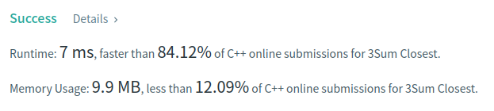

Algorithm Puzzles ~~everyday~~ ~~every week~~ sometimes: 3Sum Closest

<!--more-->

## Puzzle

Puzzle from [leetcode](https://leetcode.com):

Given an integer array nums of length n and an integer target, find three integers in nums such that the sum is closest to target.

Return the sum of the three integers.

You may assume that each input would have exactly one solution.


Example 1:

Input: nums = [-1,2,1,-4], target = 1
Output: 2
Explanation: The sum that is closest to the target is 2. (-1 + 2 + 1 = 2).

Example 2:

Input: nums = [0,0,0], target = 1
Output: 0

Constraints:

    3 <= nums.length <= 1000
    -1000 <= nums[i] <= 1000
    -104 <= target <= 104


## Solution

This puzzle is based on [3Sum](/2021/12/05/Algorithm-Puzzles-3Sum), so I just made some slight changes base on [3Sum](/2021/12/05/Algorithm-Puzzles-3Sum#Solution):

```cpp
class Solution {
 public:
  int threeSumClosest(std::vector<int>& nums, const int target) {
    m_closetDiff = nums[0] + nums[1] + nums[2] - target;
    m_target = target;

    std::sort(nums.begin(), nums.end());

    for (int i = 0; i < nums.size() - 2; ++i) {
      if (m_closetDiff == 0) {
        break;
      }
      if (i >= 1 && nums[i] == nums[i - 1]) {
        continue;
      } else {
        twoPoint(nums, nums[i], i + 1, nums.size() - 1);
      }
    }

    return m_target + m_closetDiff;
  }

 private:
  int m_closetDiff;
  int m_target;

  void twoPoint(const std::vector<int>& nums, const int& stable,
                const int& left, const int& right) {
    if (left >= right) {
      return;
    }

    int diff = nums[left] + nums[right] + stable - m_target;

    if (std::abs(diff) < std::abs(m_closetDiff)) {
      m_closetDiff = diff;
    }

    int i = 0;
    if (diff < 0) {
      for (i = 1; i < right - left; ++i) {
        if (nums[left] != nums[left + i]) {
          break;
        }
      }
      twoPoint(nums, stable, left + i, right);
    } else {
      for (i = 1; i < right - left; ++i) {
        if (nums[right] != nums[left - i]) {
          break;
        }
      }
      twoPoint(nums, stable, left, right - i);
    }
  }
};
```


