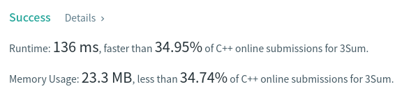

Algorithm Puzzles ~~everyday~~ ~~every week~~ sometimes: 3Sum

<!--more-->

## Puzzle

Puzzle from [leetcode](https://leetcode.com):

Given an integer array nums, return all the triplets [nums[i], nums[j], nums[k]] such that i != j, i != k, and j != k, and nums[i] + nums[j] + nums[k] == 0.

Notice that the solution set must not contain duplicate triplets.

Example 1:

Input: nums = [-1,0,1,2,-1,-4]
Output: [[-1,-1,2],[-1,0,1]]

Example 2:

Input: nums = []
Output: []

Example 3:

Input: nums = [0]
Output: []

## Solution

```cpp
class Solution {
 public:
  std::vector<std::vector<int>> threeSum(std::vector<int>& nums) {
    if (nums.size() < 3) {
      return res;
    }

    std::sort(nums.begin(), nums.end());

    for (int i = 0; i < nums.size() - 2; ++i) {
      if (i >= 1 && nums[i] == nums[i - 1]) {
        continue;
      } else {
        twoSum(nums, nums[i], i + 1, nums.size() - 1);
      }
    }

    return res;
  }

 private:
  std::vector<std::vector<int>> res;

  void twoSum(const std::vector<int>& nums, const int& target, const int& left,
              const int& right) {
    if (left >= right) {
      return;
    }

    int sum = nums[left] + nums[right] + target;

    if (sum == 0) {
      // std::vector<int> mached = ;
      res.emplace_back(std::vector<int>{target, nums[left], nums[right]});
    }

    int i = 0;
    if (sum <= 0) {
      for (i = 1; i < right - left; ++i) {
        if (nums[left] != nums[left + i]) {
          break;
        }
      }
      twoSum(nums, target, left + i, right);
    } else {
      for (i = 1; i < right - left; ++i) {
        if (nums[right] != nums[left - i]) {
          break;
        }
      }
      twoSum(nums, target, left, right - i);
    }
  }
};
```


