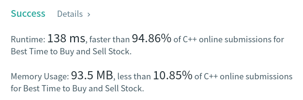

Algorithm Puzzles ~~everyday~~ ~~every week~~ sometimes: Best Time to Buy and Sell Stock
<!--more-->
## Puzzle
Puzzle from [leetcode](https://leetcode.com):
You are given an array prices where prices[i] is the price of a given stock on the i^th day.

You want to maximize your profit by choosing a single day to buy one stock and choosing a different day in the future to sell that stock.

Return the maximum profit you can achieve from this transaction. If you cannot achieve any profit, return 0.

## Solution

```cpp
class Solution {
 public:
  int maxProfit(const std::vector<int>& prices) const {
    int currentMaxProfit = 0;
    int currentMinPrice = prices[0];
    const int pricesSize = prices.size();

    for (int i = 0; i < pricesSize; i++) {
      currentMinPrice = std::min(currentMinPrice, prices[i]);
      currentMaxProfit =
          std::max(currentMaxProfit, prices[i] - currentMinPrice);
    }

    return currentMaxProfit;
  }
};
```

T.C. should be `O(n)`.
S.C. should be `O(1)`



