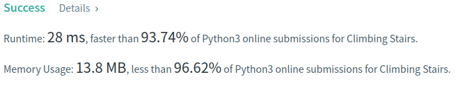

Algorithm Puzzles ~~everyday~~ ~~every week~~ sometimes: Climbing Stairs
<!--more-->

## Puzzle

Puzzle from [leetcode](https://leetcode.com):

You are climbing a staircase. It takes n steps to reach the top.

Each time you can either climb 1 or 2 steps. In how many distinct ways can you climb to the top?

## Solution

It's an easy puzzle can be resolved via dynamic programming:

- dp[1] = 1
- dp[2] = 2
- dp[3] = dp[1] + dp[2]
- dp[n] = dp[n-1] + dp[n-2]

```py
class Solution:
    def climbStairs(self, n: int) -> int:
        dp = [1, 2]
        if n <= 2:
            return dp[n-1]

        new = 0
        n = n - 2
        while n > 0:
            new = dp[0] + dp[1]
            dp[0] = dp[1]
            dp[1] = new
            n -= 1
        return new
```



TC should be O(n) and SC should be O(1).
