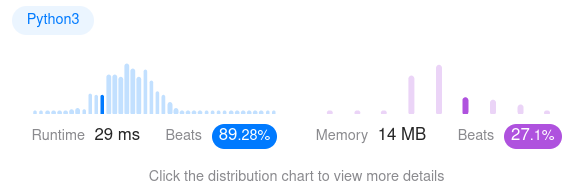

Algorithm Puzzles ~~everyday~~ ~~every week~~ sometimes: {{ title }}
<!--more-->
## Puzzle
Puzzle from [leetcode](https://leetcode.com):

A message containing letters from A-Z can be encoded into numbers using the following mapping:

'A' -> "1"
'B' -> "2"
...
'Z' -> "26"

To decode an encoded message, all the digits must be grouped then mapped back into letters using the reverse of the mapping above (there may be multiple ways). For example, "11106" can be mapped into:

    "AAJF" with the grouping (1 1 10 6)
    "KJF" with the grouping (11 10 6)

Note that the grouping (1 11 06) is invalid because "06" cannot be mapped into 'F' since "6" is different from "06".

Given a string s containing only digits, return the number of ways to decode it.

The test cases are generated so that the answer fits in a 32-bit integer.

## Solution

```py
from functools import lru_cache


class Solution:
    @lru_cache
    def numDecodings(self, s: str) -> int:
        length = len(s)
        if length == 0 or s[0] == '0':
            return 0

        if length == 1:
            return 1

        double = int(s[0:2])
        single_step = self.numDecodings(s[1:])

        if length == 2:
            if double <= 26:
                return 1 + single_step
            else:
                return single_step

        if length > 2:
            if double <= 26:
                return single_step + self.numDecodings(s[2:])
            else:
                return single_step
```

With `lru_cache`, T.C. should be `O(N)`.


