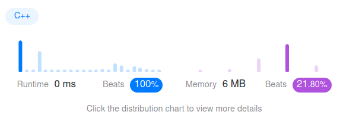

Algorithm Puzzles ~~everyday~~ ~~every week~~ sometimes: Fibonacci Number
<!--more-->
## Puzzle
Puzzle from [leetcode](https://leetcode.com):

The Fibonacci numbers, commonly denoted F(n) form a sequence, called the Fibonacci sequence, such that each number is the sum of the two preceding ones, starting from 0 and 1.

## Solution

```cpp
class Solution {
 public:
  int fib(int n) {
    if (n <= 1) {
      return n;
    }
    if (fn[n] == 0) {
      fn[n] = fib(n - 1) + fib(n - 2);
    }
    return fn[n];
  }

 private:
  int fn[30] = {0};
};
```

T.C.: `O(N)`

