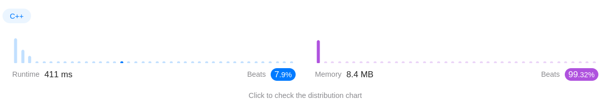
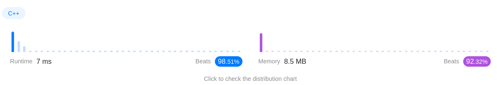

Algorithm Puzzles ~~everyday~~ ~~every week~~ sometimes: Find All Anagrams in a String
<!--more-->
## Puzzle
Puzzle from [leetcode](https://leetcode.com):

Given two strings s and p, return an array of all the start indices of p's anagrams in s. You may return the answer in any order.

An Anagram is a word or phrase formed by rearranging the letters of a different word or phrase, typically using all the original letters exactly once.

## Solution

### First Came Out Solution

```cpp
class Solution {
 public:
  std::vector<int> findAnagrams(const std::string& s,
                                const std::string& p) const {
    std::vector<int> ret = {};

    size_t sLen = s.size();
    size_t pLen = p.size();

    if (sLen < pLen) {
      return ret;
    }

    size_t pAlphabetTable[26] = {0};

    for (auto iter = p.begin(); iter != p.end(); ++iter) {
      ++pAlphabetTable[*iter - 'a'];
    }

    for (size_t i = 0; i <= sLen - pLen; ++i) {
      size_t sAlphabetTable[26] = {0};
      for (auto iter = s.begin() + i; iter != s.begin() + i + pLen; ++iter) {
        ++sAlphabetTable[*iter - 'a'];
      }
      if (std::equal(std::begin(pAlphabetTable), std::end(pAlphabetTable),
                     std::begin(sAlphabetTable))) {
        ret.emplace_back(i);
      }
    }

    return ret;
  }
};
```




### Optimized Solution
We don't need to recalculate the whole `sAlphabetTable`, just update the first one and the last one.

```cpp
class Solution {
 public:
  std::vector<int> findAnagrams(const std::string& s,
                                const std::string& p) const {
    std::vector<int> ret = {};

    size_t sLen = s.size();
    size_t pLen = p.size();

    if (sLen < pLen || sLen == 0 || pLen == 0) {
      return ret;
    }

    auto pAlphabetTable = std::vector<size_t>(26, 0);
    auto sAlphabetTable = std::vector<size_t>(26, 0);

    for (size_t i = 0; i < pLen; ++i) {
      ++pAlphabetTable[p[i] - 'a'];
      ++sAlphabetTable[s[i] - 'a'];
    }

    if (pAlphabetTable == sAlphabetTable) {
      ret.emplace_back(0);
    }

    for (size_t i = 1; i <= sLen - pLen; ++i) {
      --sAlphabetTable[s[i - 1] - 'a'];
      ++sAlphabetTable[s[i + pLen - 1] - 'a'];

      if (pAlphabetTable == sAlphabetTable) {
        ret.emplace_back(i);
      }
    }

    return ret;
  }
};
```



T.C. should be `O(26 * N) => O(N)`
