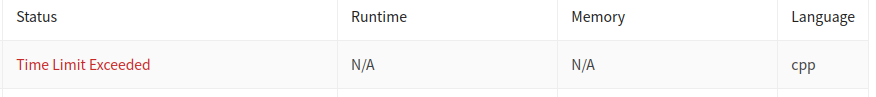
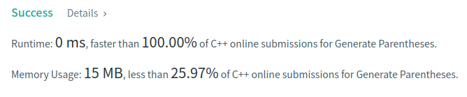

Algorithm Puzzles ~~everyday~~ ~~every week~~ sometimes: Generate Parentheses

<!--more-->

## Puzzle
Puzzle from [leetcode](https://leetcode.com):

Given `n` pairs of parentheses, write a function to generate all combinations of well-formed parentheses.

```
Example 1:

Input: n = 3
Output: ["((()))","(()())","(())()","()(())","()()()"]

Example 2:

Input: n = 1
Output: ["()"]
```

## Solving
### Recursion

For a well-formed parentheses:
- left_brackets == right_brackets
- all sub-parentheses should start with left_brackets and end with right_brackets

```cpp
class Solution {
 public:
  std::vector<std::string> generateParenthesis(const int n) {
    std::vector<std::string> res;
    max = n * 2;
    addBrackets(res, "", 0, 0);
    return res;
  };

 private:
  size_t max;
  void addBrackets(std::vector<std::string>& res, std::string&& str,
                   const size_t left, const size_t right) {
    if (str.size() == max && left == right) {
      res.emplace_back(str);
      return;
    }

    if (left < max) {
      addBrackets(res, str + "(", left + 1, right);
    }
    if (left > right) {
      addBrackets(res, str + ")", left, right + 1);
    }
  }
};
```

This code should work, but it can't pass leetcode check due to exceed time limit:



### Optimization

We can skip scenarios that left brackets or right brackets is more than `n`:

```cpp
class Solution {
 public:
  std::vector<std::string> generateParenthesis(const int n) {
    std::vector<std::string> res;
    this->n = n;
    strLen = n * 2;
    addBrackets(res, "", 0, 0);
    return res;
  };

 private:
  size_t n;
  size_t strLen;
  void addBrackets(std::vector<std::string>& res, std::string&& str,
                   const size_t left, const size_t right) {
    if ((left > n) || (right > n)) {
      return;
    }

    if (str.size() == strLen && left == right) {
      res.emplace_back(str);
      return;
    }

    if (left < strLen) {
      addBrackets(res, str + "(", left + 1, right);
    }
    if (left > right) {
      addBrackets(res, str + ")", left, right + 1);
    }
  }
};
```



