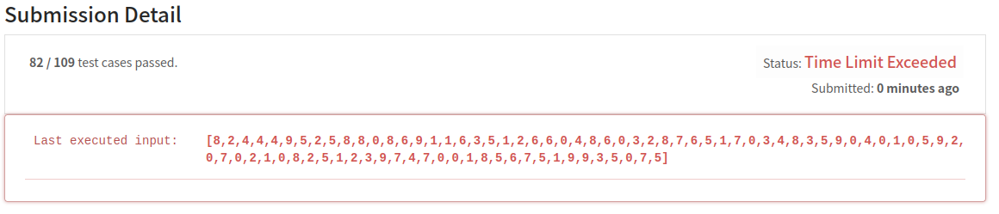
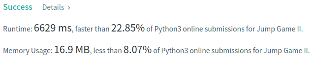
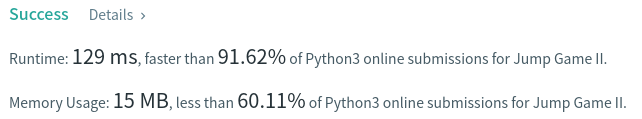

Algorithm Puzzles ~~everyday~~ ~~every week~~ sometimes: Jump Game II
<!--more-->
## Puzzle

Puzzle from [leetcode](https://leetcode.com):

Given an array of non-negative integers nums, you are initially positioned at the first index of the array.

Each element in the array represents your maximum jump length at that position.

Your goal is to reach the last index in the minimum number of jumps.

You can assume that you can always reach the last index.

## Solution

### First Came Solution: List + DP
My first came out solution is use list + dynamic programing:


```py
class Solution:
    def jump(self, nums: List[int]) -> int:
        len = nums.__len__()

        if len <= 1:
            return 0

        dp = []
        dpi = 0
        """dp[n] stands for index we can reach at n jumps"""
        dp.append(list(range(1, nums[0]+1)))
        if dp[-1][-1] >= len - 1:
            return dpi+1

        while True:
            dp.append([])
            for i in dp[dpi]:
                if nums[i] > 0:
                    dp[-1].extend(list(range(i+1, i+nums[i]+1)))
                    if dp[-1][-1] >= len - 1:
                        return dpi+2
            dpi += 1
```

It's quite straight forward that use dp[n] stands for index we can reach at n jumps, so we can base on states in previous to calculate next index. It can work if input list is small, but it will hit "Time Limit Exceeded" error when list getting bigger.



### Optimized Solution: Set + DP
My optimized solution is using set instead of list - which can prevent duplicated calculation. 
What's more, since we only care about dp[n] and dp[n-1], there is no need to store dp[0]..dp[n-2] as well.

```py
class Solution:
    def jump(self, nums: List[int]) -> int:
        len = nums.__len__()

        if len <= 1:
            return 0

        dp = []
        dpi = 0
        jumps = 0
        """dp[n] stands for index we can reach at n steps"""
        if nums[0] >= len - 1:
            return jumps+1
        else:
            dp.append(set(range(1, nums[0]+1)))
            dp.append(set())
            jumps += 1

        while True:
            jumps += 1
            dpin = 1 if dpi == 0 else 0
            for i in dp[dpi]:
                if nums[i] > 0:
                    farest = i+nums[i]
                    if farest >= len - 1:
                        return jumps
                    else:
                        dp[dpin].update(set(range(i+1, farest+1)))

            dp[dpi].clear()
            dpi = dpin
```

But the result of this solution is still not good enough...



### Greedy
Since we only care about minimal jumps to destination, we can use greedy to solve it. Give an index, we can find the farthest index we can go in next jump:

```py
class Solution:
    def jump(self, nums: List[int]) -> int:
        len = nums.__len__()
        currentMaxIndex = 0  # Max index can go at n jumps
        nextMaxIndex = 0  # Max index can go at n + 1 jumps
        jumps = 0

        for i in range(0, len):
            # If currentMaxIndex < i, we need to jump again
            if currentMaxIndex < i:
                jumps += 1
                currentMaxIndex = nextMaxIndex
            elif currentMaxIndex > len - 1:
                return jumps
            # If we are at index i, the next jump we can go to i + nums[i]
            nextMaxIndex = max(nextMaxIndex, i + nums[i])

        return jumps
```


