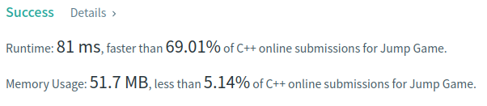
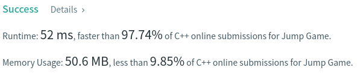

Algorithm Puzzles ~~everyday~~ ~~every week~~ sometimes: Jump Game
<!--more-->
## Puzzle
Puzzle from [leetcode](https://leetcode.com):

You are given an integer array nums. You are initially positioned at the array's first index, and each element in the array represents your maximum jump length at that position.

Return true if you can reach the last index, or false otherwise.

Example 1:

Input: nums = [2,3,1,1,4]
Output: true
Explanation: Jump 1 step from index 0 to 1, then 3 steps to the last index.

Example 2:

Input: nums = [3,2,1,0,4]
Output: false
Explanation: You will always arrive at index 3 no matter what. Its maximum jump length is 0, which makes it impossible to reach the last index.

## Solution

Looks like a typical DP puzzle, let `dp[i]` as largest index we can jump from index i, we can have:

```
dp[0] = nums[0]
dp[1] = dp[0] > nums[1] + i ? dp[0] : nums[1] + i
dp[i] = dp[i-1] > nums[i] + i ? dp[i-1] : nums[i] + i
```

Base on this we have:

```cpp
class Solution {
  public:
    bool canJump(const std::vector<int>& nums) {
        dp.emplace_back(nums[0]);

        if (dp[0] == 0 && nums.size() > 1) {
            return false;
        }

        for (int i = 1; i < nums.size(); ++i) {
            int op = nums[i] + i;
            dp.emplace_back(dp[i - 1] > op ? dp[i - 1] : op);
            if (dp[i] == i) {
                return i == nums.size() - 1 ? true : false;
            }
            if (dp[i] >= nums.size() - 1) {
                return true;
            }
        }

        return true;
    }

  private:
    std::vector<int> dp = {};
};
```



We may use size-initialed `vector` to reduce runtime:
```cpp
class Solution {
  public:
    bool canJump(const std::vector<int>& nums) {
        const int length = nums.size();

        if (nums[0] == 0 && length > 1) {
            return false;
        }

        std::vector<int> dp(length);
        dp[0] = nums[0];

        for (int i = 1; i < length; ++i) {
            int op = nums[i] + i;
            op = dp[i - 1] > op ? dp[i - 1] : op;
            if (op == i) {
                return op == length - 1 ? true : false;
            }
            if (op >= nums.size() - 1) {
                return true;
            }
            dp[i] = op;
        }

        return true;
    }
};
```

Now we have much better runtime result:



In worst case T.C. should be `O(n)` and S.C. should be `O(2n)`.
