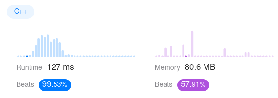

Algorithm Puzzles ~~everyday~~ ~~every week~~ sometimes: Largest Rectangle in Histogram
<!--more-->
## Puzzle
Puzzle from [leetcode](https://leetcode.com):

Given an array of integers heights representing the histogram's bar height where the width of each bar is 1, return the area of the largest rectangle in the histogram.

## Solution
### First came out solution

```cpp
class Solution {
 public:
  int largestRectangleArea(std::vector<int>& heights) {
    heightSize = heights.size();
    max = 0;
    for (int i = 0; i < heightSize; ++i) {
      int area = expandArea(heights, i);
      if (area > max) max = area;
    }
    return max;
  }

 private:
  int heightSize = 0;
  int max = 0;
  int expandArea(const std::vector<int>& heights, const int index) {
    int left = index;
    int right = index;

    while (left - 1 >= 0) {
      if (heights[left - 1] >= heights[index]) {
        left--;
        continue;
      }
      break;
    }

    while (right + 1 < heightSize) {
      if (heights[right + 1] >= heights[index]) {
        right++;
        continue;
      }
      break;
    }

    return (right - left + 1) * heights[index];
  }
};
```

T.C.: `O(N^N)`

This solution will hit "Time Limit Exceeded".

### Optimization

Record all checked borders

```cpp
class Solution {
 public:
  int largestRectangleArea(std::vector<int>& heights) {
    int heightSize = heights.size();
    int max = 0;
    auto leftBorders = std::vector<int>(heightSize);
    auto rightBorders = std::vector<int>(heightSize);
    int cur = 0;

    leftBorders[0] = -1;
    rightBorders[heightSize - 1] = heightSize;

    for (int i = 1; i < heightSize; ++i) {
      cur = i - 1;

      while (cur >= 0 && heights[cur] >= heights[i]) {
        cur = leftBorders[cur];
      }

      leftBorders[i] = cur;
    }

    for (int i = heightSize - 2; i >= 0; --i) {
      cur = i + 1;

      while (cur < heightSize && heights[cur] >= heights[i]) {
        cur = rightBorders[cur];
      }

      rightBorders[i] = cur;
    }

    for (int i = 0; i < heightSize; ++i) {
      int area = (rightBorders[i] - leftBorders[i] - 1) * heights[i];
      max = area > max ? area : max;
    }

    return max;
  }
};
```


