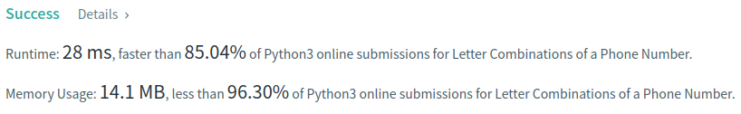

Algorithm Puzzles ~~everyday~~ ~~every week~~ sometimes: Letter Combinations of a Phone Number

<!--more-->

## Puzzle
Puzzle from [leetcode](https://leetcode.com):

Given a string containing digits from 2-9 inclusive, return all possible letter combinations that the number could represent. Return the answer in any order.

A mapping of digit to letters (just like on the telephone buttons) is given below. Note that 1 does not map to any letters.

Example 1:

Input: digits = "23"
Output: ["ad","ae","af","bd","be","bf","cd","ce","cf"]

Example 2:

Input: digits = ""
Output: []

Example 3:

Input: digits = "2"
Output: ["a","b","c"]

## Solution

```py
from typing import List


class Solution:
    hashMap = {
        '2': ['a', 'b', 'c'],
        '3': ['d', 'e', 'f'],
        '4': ['g', 'h', 'i'],
        '5': ['j', 'k', 'l'],
        '6': ['m', 'n', 'o'],
        '7': ['p', 'q', 'r', 's'],
        '8': ['t', 'u', 'v'],
        '9': ['w', 'x', 'y', 'z']
    }

    def dfs(self, res, digits: str) -> None:
        if not digits:
            return

        if not res:
            res += self.hashMap[digits[0]]
        else:
            temp = []
            for i in self.hashMap[digits[0]]:
                for j in res:
                    temp.append(j+i)

            res.clear()
            res += temp
        self.dfs(res, digits[1:])

    def letterCombinations(self, digits: str) -> List[str]:
        res = []

        self.dfs(res, digits)

        return res
```


