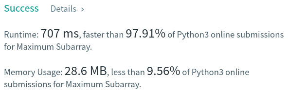

Algorithm Puzzles ~~everyday~~ ~~every week~~ sometimes: Maximum Subarray
<!--more-->
## Puzzle
Puzzle from [leetcode](https://leetcode.com):

Given an integer array nums, find the contiguous subarray (containing at least one number) which has the largest sum and return its sum.

A subarray is a contiguous part of an array.

## Solution

```py
class Solution:
    def maxSubArray(self, nums: List[int]) -> int:
        maxSum = nums[0]
        currentSum = 0
        for num in nums:
            currentSum += num
            if currentSum > maxSum:
                maxSum = currentSum
            # Abandon current sum since adding this is causing descending results
            if currentSum < 0:
                currentSum = 0
        return maxSum
```

TC: O(n)


