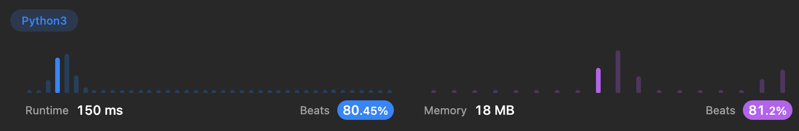

Algorithm Puzzles ~~everyday~~ ~~every week~~ sometimes: Merge Intervals
<!--more-->
## Puzzle
Puzzle from [leetcode](https://leetcode.com):

Given an array of intervals where intervals[i] = [starti, endi], merge all overlapping intervals, and return an array of the non-overlapping intervals that cover all the intervals in the input.

## Solution

Sort input list, then find overlaps

```py
class Solution:
    def merge(self, intervals: List[List[int]]) -> List[List[int]]:
        intervals.sort(key=lambda x:x[0])
        i = 1
        ret = []
        temp = intervals[0]
        length = len(intervals)
        while i < length:
            compare=intervals[i]
            if temp[1] >= compare[0]:
                temp[1] = max(temp[1], compare[1])
            else:
                ret.append(temp)
                temp=compare
            i += 1
        ret.append(temp)
        
        return ret
```



T.C. should be O(N * logN)
> Sort takes O(N * logN)
