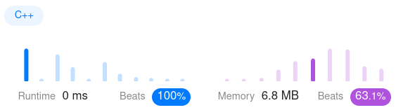

Algorithm Puzzles ~~everyday~~ ~~every week~~ sometimes: Remove Duplicate Letters
<!--more-->
## Puzzle
Puzzle from [leetcode](https://leetcode.com):

Given a string s, remove duplicate letters so that every letter appears once and only once. You must make sure your result is
the smallest in lexicographical order
among all possible results.
## Solution
### MonotonicStack

```cpp
class Solution {
 public:
  std::string removeDuplicateLetters(const std::string& s) const {
    int lastOccur[26] = {-1};
    size_t len = s.length();
    int visited[26] = {0};
    std::stack<int> stk = {};
    std::string ret = "";

    for (int i = 0; i < len; ++i) {
      lastOccur[s[i] - 'a'] = i;
    }

    for (int i = 0; i < len; ++i) {
      if (visited[s[i] - 'a'] == 0) {
        while (!stk.empty() && s[stk.top()] > s[i] &&
               lastOccur[s[stk.top()] - 'a'] > i) {
          visited[s[stk.top()] - 'a'] = 0;
          stk.pop();
        }
        stk.push(i);
        visited[s[i] - 'a'] = 1;
      }
    }

    while (!stk.empty()) {
      ret = s[stk.top()] + ret;
      stk.pop();
    }

    return ret;
  }
};
```

T.C: `O(N*N)`


