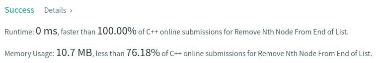

Algorithm Puzzles ~~everyday~~ ~~every week~~ sometimes: Remove Nth Node From End of List
<!--more-->

## Puzzle

Puzzle from [leetcode](https://leetcode.com):

Given the head of a linked list, remove the nth node from the end of the list and return its head.

## Solution

Here I use 3 marks to mark node:
- The node need to be removed: `rmMark`
- The previous node of `rmMark`: `rmMarkP`
- The next node of `rmMark`: `rmMarkN`

```cpp
/**
 * Definition for singly-linked list.
 * struct ListNode {
 *     int val;
 *     ListNode *next;
 *     ListNode() : val(0), next(nullptr) {}
 *     ListNode(int x) : val(x), next(nullptr) {}
 *     ListNode(int x, ListNode *next) : val(x), next(next) {}
 * };
 */
class Solution {
  public:
    ListNode* removeNthFromEnd(ListNode* head, const int n) {
        ListNode* rmMarkP = nullptr;
        ListNode* rmMark = nullptr;
        ListNode* rmMarkN = nullptr;
        ListNode* cur = head;

        int distance = 0;
        cur = rmMark = head;

        while (cur != nullptr) {
            if (distance < n) {
                distance++;
            } else {
                rmMarkP = rmMark;
                rmMark = rmMark->next;
                rmMarkN = rmMark->next;
            }
            cur = cur->next;
        }

        if (rmMarkP == nullptr && rmMark != nullptr) {
            // remove head
            head = rmMark->next;
        } else {
            rmMarkP->next = rmMarkN;
        }

        return head;
    }
};
```


