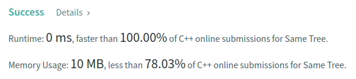

Algorithm Puzzles ~~everyday~~ ~~every week~~ sometimes: Same Tree
<!--more-->
## Puzzle

Puzzle from [leetcode](https://leetcode.com):

Given the roots of two binary trees p and q, write a function to check if they are the same or not.

Two binary trees are considered the same if they are structurally identical, and the nodes have the same value.

## Solution

It's an easy puzzle can be resolved via dfs or bfs, here I use dfs:

```cpp
class Solution {
  public:
    bool isSameTree(const TreeNode* p, const TreeNode* q) const {
        if (p == q && p == nullptr) {
            return true;
        } else if (p == nullptr || q == nullptr) {
            return false;
        }

        if (p->val != q->val) {
            return false;
        } else {
            return isSameTree(p->left, q->left) &&
                   isSameTree(p->right, q->right);
        }
    }
};
```

TC should be O(n) and SC should be O(h) where n is node number and h is tree height.


