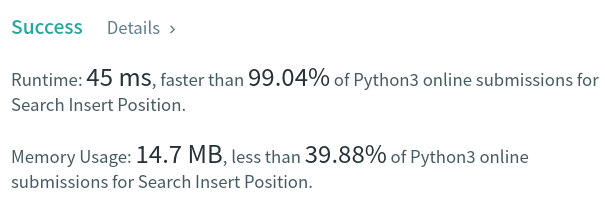

Algorithm Puzzles ~~everyday~~ ~~every week~~ sometimes: Search Insert Position
<!--more-->
## Puzzle
Puzzle from [leetcode](https://leetcode.com):

Given a sorted array of distinct integers and a target value, return the index if the target is found. If not, return the index where it would be if it were inserted in order.

You must write an algorithm with O(log n) runtime complexity.

## Solution

This puzzle can be resolved by binary search easily:

```py
class Solution:
    def searchInsert(self, nums: List[int], target: int) -> int:
        left = 0
        right = len(nums) - 1
        while left<=right:
            i = int((left + right)/2)
            if target == nums[i]:
                return i
            elif target < nums[i]:
                right = i - 1
            else:
                left = i + 1
        return left
```



T.C.: `O(logN)`
