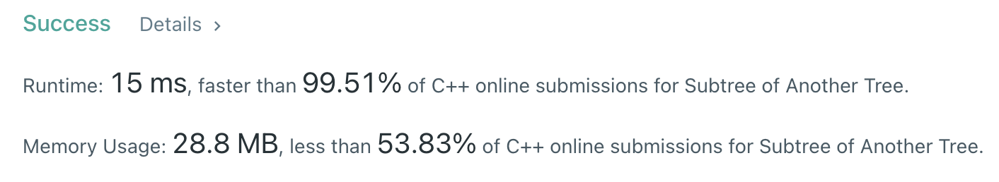

Algorithm Puzzles ~~everyday~~ ~~every week~~ sometimes: Subtree of Another Tree
<!--more-->
## Puzzle
Puzzle from [leetcode](https://leetcode.com):

Given the roots of two binary trees root and subRoot, return true if there is a subtree of root with the same structure and node values of subRoot and false otherwise.

A subtree of a binary tree tree is a tree that consists of a node in tree and all of this node's descendants. The tree tree could also be considered as a subtree of itself.

## Solution

```cpp
class Solution {
  public:
    bool isSubtree(const TreeNode* root, const TreeNode* subRoot) const {
        if (!bfs(root, subRoot)) {
            if (root->left != nullptr) {
                if (isSubtree(root->left, subRoot)) {
                    return true;
                }
            }
            if (root->right != nullptr) {
                if (isSubtree(root->right, subRoot)) {
                    return true;
                }
            }
        } else {
            return true;
        }

        return false;
    }

  private:
    bool bfs(const TreeNode* root, const TreeNode* subRoot) const {
        if (subRoot == nullptr && root == nullptr) {
            return true;
        }

        if (root == nullptr || subRoot == nullptr) {
            return false;
        }

        if (root->val == subRoot->val) {
            if (!bfs(root->left, subRoot->left)) {
                return false;
            }
            if (!bfs(root->right, subRoot->right)) {
                return false;
            }
        } else {
            return false;
        }

        return true;
    }
};
```



T.C.: O(M*N)
