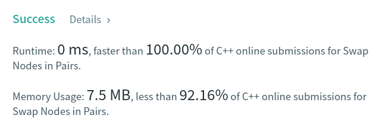

Algorithm Puzzles ~~everyday~~ ~~every week~~ sometimes: {{ title }}
<!--more-->
## Puzzle
Puzzle from [leetcode](https://leetcode.com):

Given a linked list, swap every two adjacent nodes and return its head. You must solve the problem without modifying the values in the list's nodes (i.e., only nodes themselves may be changed.)

## Solution

Easy to solve via recursion:

```cpp
class Solution {
 public:
  ListNode* swapPairs(ListNode* head) {
    if (head == nullptr || head->next == nullptr) {
      return head;
    }

    ListNode* tmpNode = head->next;
    head->next = tmpNode->next;
    tmpNode->next = head;

    if (previous != nullptr) {
      previous->next = tmpNode;
    }
    previous = head;

    swapPairs(head->next);

    return tmpNode;
  }

 private:
  ListNode* previous = nullptr;
};
```

T.C. should be `O(n)`, S.C. should be `O(n)` as well


