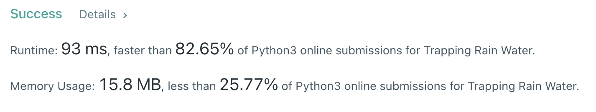

Algorithm Puzzles ~~everyday~~ ~~every week~~ sometimes: Trapping Rain Water

<!--more-->

## Puzzle

Puzzle from [leetcode](https://leetcode.com):

Given n non-negative integers representing an elevation map where the width of each bar is 1, compute how much water it can trap after raining.

Example 1:


```
Input: height = [0,1,0,2,1,0,1,3,2,1,2,1]
Output: 6
Explanation: The above elevation map (black section) is represented by array [0,1,0,2,1,0,1,3,2,1,2,1].
In this case, 6 units of rain water (blue section) are being trapped.
```

## Solution

### Two point with bar

My first solution is using two point with a bar:

```py
class Solution:
    sum: int = 0

    def twoPoint(self, height: List[int],
                 left: int, right: int, bar: int) -> None:
        if left >= right or right >= height.__len__():
            return

        while left < (height.__len__() - 1) and height[left] < bar:
            left += 1

        while right < height.__len__() \
                and height[right] < bar or right <= left:
            right += 1

        if left < right and right < height.__len__():
            self.sum += (right - left) - 1

        left = right
        right += 1

        self.twoPoint(height, left, right, bar)

    def trap(self, height: List[int]) -> int:
        for i in range(1, max(height) + 1):
            self.twoPoint(height, 0, 1, i)
        return self.sum
```

But this solution will have time complexity up to `O(n*max(height))`, which makes it failed at some test cases on leetcode due to exceed time limit.

### Optimized two point

This optimized solution will try to find the two max height blocks:

```py
class Solution:
    def trap(self, height: List[int]) -> int:
        if height.__len__() < 3:
            return 0

        sum = 0
        left = 0
        right = height.__len__() - 1
        leftMax = 0
        rightMax = 0

        while left < right:
            if height[left] < height[right]:
                if height[left] > leftMax:
                    leftMax = height[left]
                else:
                    sum += leftMax - height[left]
                left += 1
            else:
                if height[right] > rightMax:
                    rightMax = height[right]
                else:
                    sum += rightMax - height[right]
                right -= 1

        return sum
```

In this case time complexity is `O(n)`:


