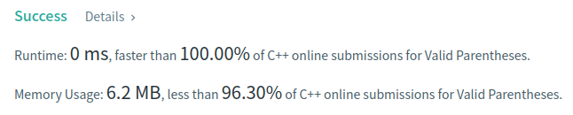

Algorithm Puzzles ~~everyday~~ ~~every week~~ sometimes: Valid Parentheses

<!--more-->

## Puzzle

Puzzle from [leetcode](https://leetcode.com):

Given a string s containing just the characters '(', ')', '{', '}', '[' and ']', determine if the input string is valid.

An input string is valid if:

    Open brackets must be closed by the same type of brackets.
    Open brackets must be closed in the correct order.

## Solution

It's an easy puzzle can be easily resolved via stack:

```cpp
class Solution {
  public:
    bool isValid(const std::string& s) {
        std::stack<char> stack;
        for (auto it = s.begin(); it != s.end(); ++it) {
            switch (*it) {
                case '(':
                case '[':
                case '{':
                    stack.emplace(*it);
                    break;
                case ')':
                    if (!stack.empty() && stack.top() == '(') {
                        stack.pop();
                    } else {
                        return false;
                    }
                    break;
                case ']':
                    if (!stack.empty() && stack.top() == '[') {
                        stack.pop();
                    } else {
                        return false;
                    }
                    break;
                case '}':
                    if (!stack.empty() && stack.top() == '{') {
                        stack.pop();
                    } else {
                        return false;
                    }
                    break;
                default:
                    return false;
            }
        }
        if (stack.empty()) {
            return true;
        }
        return false;
    }
};
```



To simplify case-branches, maybe we can use a hash map to find target `stack.top()`.
