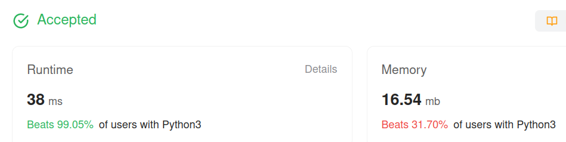

Algorithm Puzzles ~~everyday~~ ~~every week~~ sometimes: Algorithm Puzzles: Word Break
<!--more-->
## Puzzle
Puzzle from [leetcode](https://leetcode.com):

Given a string s and a dictionary of strings wordDict, return true if s can be segmented into a space-separated sequence of one or more dictionary words.

Note that the same word in the dictionary may be reused multiple times in the segmentation.

## Solution

### First Came Out Solution
It can be easily implemented via recursion, but will hit Time Limit Exceeded error:

```py
class Solution:
    def wordBreak(self, s: str, wordDict: List[str]) -> bool:
        if s.__len__() == 0:
            return True

        for word in wordDict:
            if s.startswith(word):
                if self.wordBreak(s[word.__len__():], wordDict):
                    return True

        return False
```

### DP

Let `dp[i] == true if (dp[i-len(word)] == true && s[i-len(word):i] == word)`

```py
class Solution:
    def wordBreak(self, s: str, wordDict: List[str]) -> bool:
        sLen = len(s)
        dp = [False] * (sLen+1)
        dp[0] = True
        for i in range(1, sLen+1):
            for word in wordDict:
                wordLen = len(word)
                if wordLen > sLen:
                    continue
                if dp[i-wordLen] and word == s[i-wordLen:i]:
                    dp[i] = True

        return dp[-1]
```


