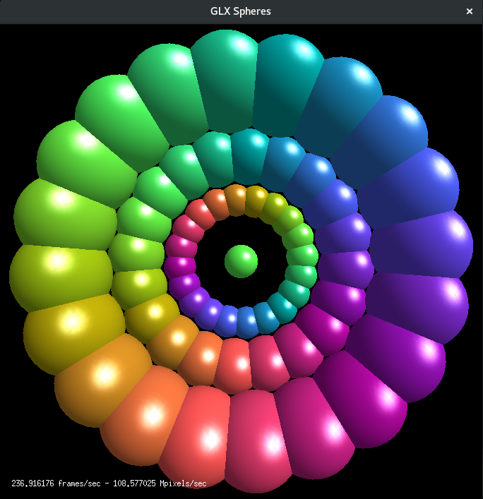
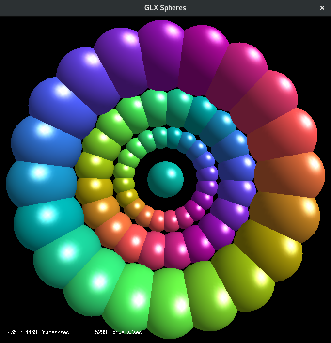

Bumblebee aims to provide support for NVIDIA Optimus laptops for GNU/Linux distributions([Bumblebee porject](https://www.bumblebee-project.org/), [Debian wiki](https://wiki.debian.org/Bumblebee/)). It can help to solve the overheat problem caused by dual dispaly card, also provide a easy way to install nvidia close source driver as well.
<!--more-->

## Update your source.list
To install nvidia close source driver, you need to add contrib non-free at every "main" item in your source.list:
```bash
sudo sed -i.bak 's/stretch[^ ]* main$/& contrib non-free/g' /etc/apt/sources.list
```
This command will help you to do that meanwhile create a .bak file to backup your origin source.list.
Don't forget to do apt update after that:
```bash
sudo apt update
```

## Install Bumblebee
If you have installed nvidia driver before, you should remove them to continue:
```bash
sudo apt-get remove nvidia*
```
Then you can start to install bumblebee now:
```bash
sudo apt install bumblebee-nvidia primus
```
Don't worry about **nouveau** driver, bumblebee will help you to handle it.
Then we need to add your user account to bumlebee group:
```bash
sudo adduser $USER bumlebee
```
After that you might need to restart your computer. Application will use your intel card by default. If you want some application use your nvidia card, use
```bash
optirun $(YOURAPP)
```

## Verify your driver
A easy way to verify this is to use **glxspheres**. It's a part of [virtualgl project](https://virtualgl.org/). **glxgears** is not recommended because it's not a tool for benchmarking.
We can use Intel display card to run it first:
```bash
vblank_mode=0 /opt/VirtualGL/bin/glxspheres64
```
**vblank_mode=0** will temporarily disable vertical synchronization. If you don't add it, you might only can get 60 fps which is same as your monitor refresh rate. The result I got:



Then run it with nvidia card:
```bash
vblank_mode=0 optirun /opt/VirtualGL/bin/glxspheres64
```



It's much faster than Intel card.
