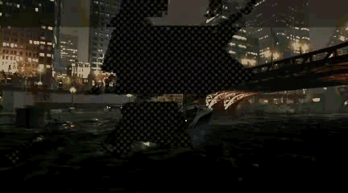

Markdown 常用语法小结

写了这么久的md, 偶尔还是会忘记一些细节，干脆写篇日志总结一下，以备不时之需
<!--more-->

## Highlight(突出显示)
| Item                   | How to use                                                 | Preview                                 |
| :--------------------: | :--------------------------------------------------------: | :-------------------------------------: |
| Bold(加粗)             | \*\*Bold Text\*\*                                          | **Bold Text**                           |
| Italic(斜体)           | \*Italic Text\*                                            | *Italic Text*                           |
| Strike Through(删除线) | \~\~Strike Through Text\~\~                                | ~~Strike Through Text~~                 |
| Font Color(字体颜色)   | &lt;span style=&quot;color:red&quot;>Red Text&lt;/span&gt; | <span style="color:red">Red Text</span> |

Markdown本身不支持更改字体颜色，但是支持插入HTML, 上面的&lt;span&gt;其实是HTML的标签。 如果还有其他奇奇怪怪的要求(如更改字体，更改大小，设置指针样式)，也可以使用&lt;span&gt;实现:
```html
<span style="color:blue;font-family:Impact;font-style:italic;cursor:crosshair;font-size:30px">Impact font blue italic 30px with crosshair pointer</span>
```

效果如下（鼠标移到上面试试）：

<span style="color:blue;font-family:Impact;font-style:italic;cursor:crosshair;font-size:30px">Impact font blue italic 30px with crosshair pointer</span>

## Table(表格)

Markdown 支持插入简单的表格:

```md
| Default   | left aligned | right aligned | mid aligned |
| --------- | :----------- | ------------: | :---------: |
| short     | short        | short         | short       |
| long text | long text    | long text     | long text   |
```
效果如下：

| Default   | left aligned | right aligned | mid aligned |
| --------- | :----------- | ------------: | :---------: |
| short     | short        | short         | short       |
| long text | long text    | long text     | long text   |

表格内容的对齐方式可以通过更改"&minus;&minus;&minus;"进行调整：
```md
-----    //默认，标题居中，内容左对齐
:----    //标题和内容都左对齐
-----:   //标题和内容都右对齐
:----:   //标题和内容都居中对齐
```

## Insert image or super link(图片和超链接)
### 图片
  使用**\!\[Background Text\](image_path 'Title')**可以插入图片, 其中:
  - Background Text: 显示在图片下层的文字，也就是说如果图片显示正常的话一般会被挡住看不见
  - image_path: 图像源文件的路径。可以是网络链接，也可以是本地路径
  - Title: 显示在图片下方的标题

如：

```md

```


### 超链接
使用**\[Suerp_Link\](url)**的方式插入超链接, 其中:
  - Suerp_Link: 超链接显示的文本
  - url: 指向的链接

如:

```md
[一位程序员，比较帅的那种](https://www.lzqblog.top)
```

[一位程序员，比较帅的那种](https://www.lzqblog.top)

## Check box

Markdown也支持带check box的样式，用户可以通过单击来框选，但是这种样式在静态页面中没什么用

```md
- [x] item1
- [ ] item2
- [x] item3
```

- [x] item1
- [ ] item2
- [x] item3


## Flow(流程图)

Markdown 甚至支持直接画流程图


要创建流程图只需两步：1.声明元素 2.连接元素
一个简单的例子：

\`\`\`flow
flow
st=>start: Main Start:>www.lzqblog.top
input=>inputoutput: input a
op=>operation: a--
sb=>subroutine: a = a!
cond=>condition: a > 100?
output=>inputoutput: print a
e=>end
st->input->op->cond
cond(no,right)->sb(right)->output(right)->op
cond(yes,down)->e
\`\`\`
效果如下：

```flow
flow
st=>start: Main Start:>http://www.lzqblog.top
input=>inputoutput: input a
op=>operation: a--
sb=>subroutine: a = a!
cond=>condition: a > 100?
output=>inputoutput: print a
e=>end
st->input->op->cond
cond(no,right)->sb(right)->output(right)->op
cond(yes,down)->e
```

### 流程图的基本语法
**声明元素**:

tag=>type: content:>url

tag 为标签，在连接元素的时候会用到
type为元素类型，常用的有 start condition operation inputoutput subroutine end几种
content 为显示在元素中的内容
url为可添加的超链接

**连接元素**：
对于非条件元素:
tag1->tag2
默认的箭头方向是向下(down)，也可以指定箭头方向：
tag1(right)->tag2
对于条件元素(condition)，多了一个yes or no参数:
condition_tag(no,right)->tag2
condition_tag(yes,down)->tag2

注： hexo默认不支持Markdown流程图，要在hexo上显示流程图需要安装hexo-filter-flowchart

```bash
npm install --save hexo-filter-flowchart
```

常用的差不多就这些，有想到的以后再补充吧


