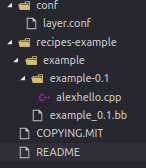

This post will tell you how to create your own general layer with a "hello world" app to be built into your EVK.
<!--more-->
Before start, you should run **setup-environment** first.

## Create your layer

### Create layer example by bitbake-layers
Use **bitbake-layers create-layer &lt;layer name&gt;** to create a general layer example.

```bash
$ cd imx-yocto-bsp/source # you also can create your layer in other path
$ bitbake-layers create-layer meta-alexlayer
```

Notice: **yocto-layer** has been deprecated after Yocto 2.5. See [yocto ref manual](https://www.yoctoproject.org/docs/current/ref-manual/ref-manual.html#detailed-supported-distros) for more details.
> The yocto-bsp, yocto-kernel, and yocto-layer scripts previously shipped with poky but not in OpenEmbedded-Core have been removed. These scripts are not maintained and are outdated. In many cases, they are also limited in scope. The bitbake-layers create-layer command is a direct replacement for yocto-layer

It will help you to create a layer with priority of 6. To change to other priority, add option "‐‐priority" or edit **BBFILE_PRIORITY** after creation.

### Modification

Go to your layer path, add some stuff into your *conf/layer.conf*:

```
IMAGE_INSTALL_append += "example"
LAYERSERIES_COMPAT_meta-alexlayer = "sumo"
```

IMAGE_INSTALL_append will tell bitbake to install your app into image.
Notice: It's required by Yocto Project Compatible version 2 standard to set **LAYERSERIES_COMPAT**. There will be a warning if you didn't do so. see [yocto ref manual](https://www.yoctoproject.org/docs/latest/ref-manual/ref-manual.html) for more details.
> Note
> 
> Setting LAYERSERIES_COMPAT is required by the Yocto Project Compatible version 2 standard. The OpenEmbedded build system produces a warning if the variable is not set for any given layer.

Then add your source code:
```bash
$ cd meta-alexlayer/recipes-example/example
$ mkdir example-0.1
$ cd example-0.1
$ touch alexhello.cpp
```
my example here :
```cpp
// alexhello.cpp
#include <iostream>

int main(){
    std::cout << "hello world from alexlayer" << std::endl;
    return 0;
}
```
Then modify your recipe file **example_0.1.bb**:

```bb
SUMMARY = "bitbake-layers recipe"
DESCRIPTION = "Recipe created by bitbake-layers"
LICENSE = "MIT"
LIC_FILES_CHKSUM = "file://${COMMON_LICENSE_DIR}/MIT;md5=0835ade698e0bcf8506ecda2f7b4f302"

TARGET_CC_ARCH += "${LDFLAGS}"

SRC_URI = "file://alexhello.cpp"

S = "${WORKDIR}"

do_compile() {
    ${CXX} alexhello.cpp -o alexhello
}

do_install() {
    install -d ${D}${bindir}
    install -m 0755 alexhello ${D}${bindir}
}

python do_build() {
    bb.plain("***********************************************");
    bb.plain("*                                             *");
    bb.plain("*  Example recipe created by bitbake-layers   *");
    bb.plain("*                                             *");
    bb.plain("***********************************************");
}
```

Notice: Here we use <span style="color:red">**TARGET_CC_ARCH += "${LDFLAGS}"**</span> to avoid **"No GNU_HASH in the elf binary"** error when QA check, see [mega-manual](https://www.yoctoproject.org/docs/current/mega-manual/mega-manual.html) for more details.
> 25.10.8. Default Linker Hash Style Changed
>
> The default linker hash style for gcc-cross is now "sysv" in order to catch recipes that are building software without using the OpenEmbedded LDFLAGS. This change could result in seeing some "No GNU_HASH in the elf binary" QA issues when building such recipes. You need to fix these recipes so that they use the expected LDFLAGS. Depending on how the software is built, the build system used by the software (e.g. a Makefile) might need to be patched. However, sometimes making this fix is as simple as adding the following to the recipe:
>
>     TARGET_CC_ARCH += "${LDFLAGS}"

After those steps, you should have a folder like this:


## Add your layer and build

There are two ways to add your layer into build:

### Use **bitbake-layers add-layer**
Use **bitbake-layers add-layer &lt;layer name&gt;** to add a layer and build it. Before this, you should source **setup-environment**.

```bash
$ bitbake-layers add-layer meta-alexlayer
$ bitbake example
```

### Modify script provided by nxp
Modify **fsl-setup-release.sh**, add your layer path to "BBLAYERS":
```bash
echo "BBLAYERS += \" \${BSPDIR}/sources/meta-qt5 \"" >> $BUILD_DIR/conf/bblayers.conf
echo "BBLAYERS += \" \${BSPDIR}/sources/meta-alexlayer \"" >> $BUILD_DIR/conf/bblayers.conf # new layer
```
Then source it and **bitbake** your new layer:
```bash
$ DISTRO=fsl-imx-xwayland MACHINE=imx8mmevk source fsl-setup-release.sh -b build-xwayland
$ bitbake example
```

## Rebuild your image file
```bash
$ bitbake fsl-image-qt5-validation-imx
```
