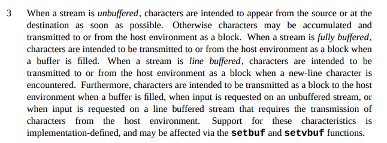

Sometimes we noticed that `printf` will only flush after there is a newline in the print string, this behavior is caused by `stdout` stream buffer, which is line buffered by default. This behavior has been mentioned in ISO C99 standard:



There are few options to make it to print immediately once you called it.

<!--more-->

## Option 1: fflush

```c
printf("test");
fflush(stdout);
```

`fflush` will flush `stdout` immediately.

## Option 2: setbuf

```c
setbuf(stdout, NULL);
printf("test");
```

`setbuf(stdout, NULL);` will disable `stdout` buffering.

It also have a secure version:

```c
setvbuf (stdout, NULL, _IONBF, BUFSIZ);
```

> [Reference](https://stackoverflow.com/questions/1716296/why-does-printf-not-flush-after-the-call-unless-a-newline-is-in-the-format-strin)
