Prepared by Coding Spirit, with love 💗
<!--more-->
## 前言
这篇文章适用于我亲爱的龚老师了解**Windows**下个人博客的搭建流程。
## 工具准备
### Git
**Git**可能是目前这个星球上最多人用的分布式版本控制系统。我们的博客源码会通过Git发布到GitHub或者其他第三方托管平台上。 有了版本控制系统，我们还可以很轻松地**备份,追踪改动,回滚**代码和文档(当然还有很多其他用处啦)。
#### Windows
这是之前给我的淇淇写的windows下的git安装指南
##### 下载Git
[Git下载](https://git-scm.com/download/) 记得挂VPN不然下载可能有点慢
##### 安装Git
可以使用默认安装选项一路next过去~ 当然也可以根据个人需求做出调整~
##### 验证安装
安装完成后在开始菜单搜索Git应该会出现Git bash:
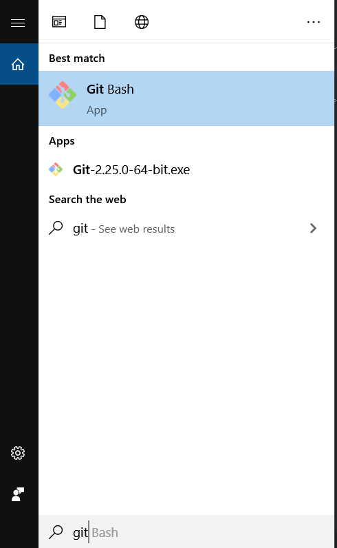

运行Git bash, 输入命令`git --version`:
```bash
$ git --version
git version 2.25.0.windows.1
```

#### Ubuntu
这是2020/09/20给我的乖淇淇写的Ubuntu下的git安装指南~
#### 安装Git

```bash
sudo apt install git gitk
```

#### 验证安装

```bash
git --version
```


#### 配置Git
如果是Windows,下面的操作都在Git bash里进行。
##### 全局配置用户名和邮箱
```
git config --global user.name "Alex.Li"
git config --global user.email "Alex.Li@xxxx.com"
```
##### 生成SSH密钥
```
ssh-keygen -t rsa -C "Alex.Li@xxxx.com"
```
注意`-C`后面是之前配置的邮箱。输入后会有几个确认，直接按回车就行。
生成完之后可以使用`cat .ssh/id_rsa.pub`检查一下。
##### 添加SSH密钥到Github
首先登陆[Github](https://github.com), 然后跳转到GitHub设置:

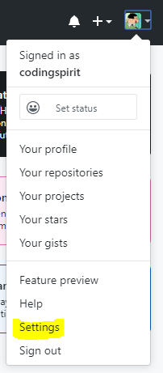

然后添加SSH key:
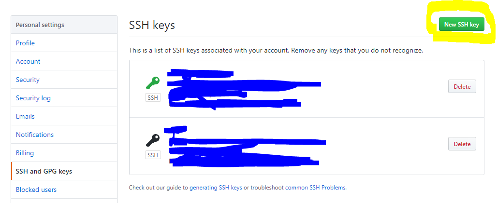
复制刚才`cat .ssh/id_rsa.pub`的输出到这里:
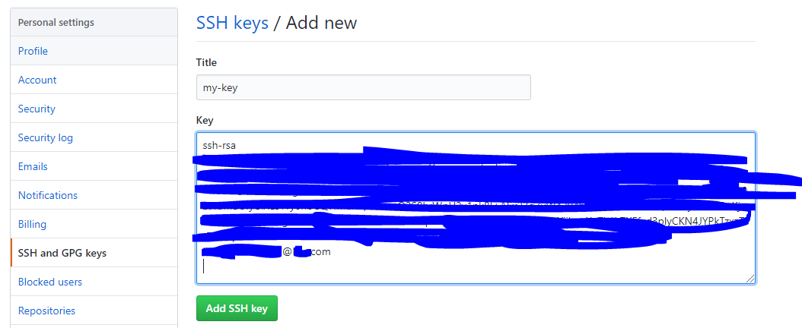
然后点击**Add SSH Key**，再输入密码确认授权就可以了

##### 测试SSH Key
在Git bash中输入命令`ssh -T git@github.com`:
```
$ ssh -T git@github.com
The authenticity of host 'github.com (52.192.72.89)' can't be established.
RSA key fingerprint is SHA256:xxxxxxxxxxxxxxxxxxxxxxxxxxxxxxxxxxxxxxxxxxx.
Are you sure you want to continue connecting (yes/no/[fingerprint])? yes
Warning: Permanently added 'github.com,52.192.72.89' (RSA) to the list of known hosts.
Hi codingspirit! You've successfully authenticated, but GitHub does not provide shell access.
```
当出现上面的输出，SSH密钥添加就完成啦。

##### 添加SSH密钥到Coding.net

由于国内访问GitHub比较慢， 我们可能会选择把网站同时部署到[Coding.net](https://coding.net/)。在登录后。。。 等等， 我的小可爱可能忘了她的帐号😘(我记得是你的163邮箱呢)

哎呀哎呀，我写不动了，你要先亲我一口

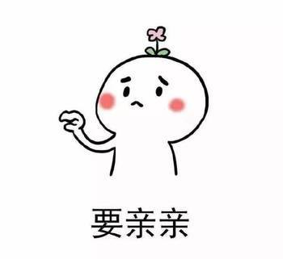

亲到啦～ 又有动力啦

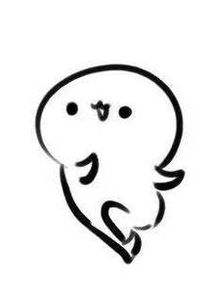

在登录到coding.net后，点击右上角的个人账户设置:

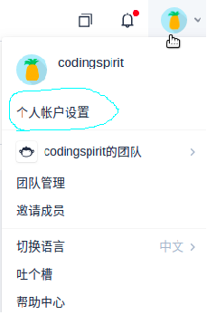

然后在SSH公钥配置界面点击新增公钥

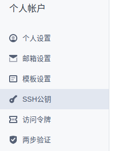

然后就和GitHub添加SSH Key一样啦~

### Node.js
**Node.js** 是一个被广泛使用的JavaScript运行环境。**Node.js**自带的包管理(npm)可以帮助配置安装博客需要的各种js.

#### Windows
这一段是之前写给我的淇可爱的Windows安装指南~
##### 下载Node.js
[Node.js 下载](https://nodejs.org/dist/v12.14.1/node-v12.14.1-x64.msi) 记得挂VPN不然下载可能有点慢
##### 安装Node.js
注意不要改动默认安装地址
##### 验证安装
安装完成后，使用`Windows+R`启动cmd:
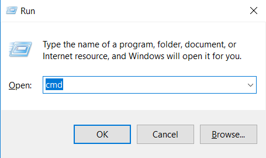

输入命令`node -v`和`npm -v`:
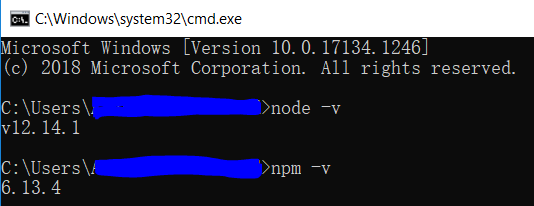

#### Ubuntu
这一段是2020/09/20为我的淇可爱新增的Ubuntu安装指南~
##### 安装Node.js
```bash
curl -sL https://deb.nodesource.com/setup_12.x | sudo -E bash -
sudo apt-get install -y nodejs
```
##### 验证Node.js
我们可以通过查看node版本的方式来验证是否安装成功

```bash
node -v
v12.18.4
```

#### 设置淘宝镜像(这一步不管Windows还是Linux都要做哦~)
因为某些原因，国内使用npm访问npm官方源会非常慢，这里推荐使用阿里的镜像:

```
npm config set registry https://registry.npm.taobao.org
```

### Hexo
Hexo是一个比较流行的博客框架。我们将基于这个框架搭建自己的博客。
#### 安装Hexo
```
npm install -g hexo-cli
```
#### 验证Hexo
同样可以通过查询版本的方式检查Hexo的安装情况:
```
$ hexo -v
hexo-cli: 3.1.0
os: Windows_NT 10.0.17134 win32 x64
node: 12.14.1
v8: 7.7.299.13-node.16
uv: 1.33.1
zlib: 1.2.11
brotli: 1.0.7
ares: 1.15.0
modules: 72
nghttp2: 1.40.0
napi: 5
llhttp: 2.0.1
http_parser: 2.8.0
openssl: 1.1.1d
cldr: 35.1
```
> 注： 在安装好Git bash后， hexo的相关操作可以在Git bash下进行

## 搭建博客(基础)
上面我们准备好了搭建博客所需的基本工具，下面就正式开始搭博客啦
> 注：下面的命令可以在Git bash中完成
### Hexo框架初始化
首先我们要准备一个空的工作目录，然后在这个工作目录下:
```bash
hexo init .
```
上述命令会在当前目录初始化Hexo的博客框架并自动添加*landspace*为默认主题。初始化完成后，我们可以通过`hexo s`在本地启动博客服务器：
```
$ hexo s
INFO  Start processing
INFO  Hexo is running at http://localhost:4000 . Press Ctrl+C to stop.
```
这时通过浏览器访问[http://localhost:4000](http://localhost:4000)就可以看到初始化完成的博客啦
### 博客目录结构
在博客初始化完成后，工作目录下将生成下面的目录结构：
```
.
├── _config.yml
├── db.json
├── node_modules
├── package.json
├── package-lock.json
├── scaffolds
├── source
└── themes

4 directories, 4 files
```
* _config.yml: 该文件为博客的配置文件
* source: 该文件夹为资源文件夹，将用于储存用户的资源文件(博客文章，插图等)
* themes: 该文件夹为主题文件夹，将用于储存主题相关的文件
* scaffolds: 该文件为模板文件夹，新生成的博文将基于这里的模板

### 主题
通过切换不同的主题可以生成不同风格的博客。我们可以在[GitHub(点我点我!)](https://github.com/search?o=desc&q=hexo-theme&s=stars&type=Repositories)上搜到非常多的主题仓库，下面列出几个比较受欢迎的主题:
* [Yilia](https://github.com/litten/hexo-theme-yilia): 一个简洁风格的主题
* [Next](https://github.com/theme-next/hexo-theme-next): 一个布局简洁但功能丰富的主题
* [Butterfly](https://github.com/jerryc127/hexo-theme-butterfly): 一个风格独特的主题

主题的下载可以通过`git clone`到 *theme* 文件夹下完成，下载完主题后，通过修改根目录下 *_config.yml* 的**theme**来进行主题的切换:
```yml
# Extensions
## Plugins: https://hexo.io/plugins/
## Themes: https://hexo.io/themes/
theme: landscape
```
正如yml中提到的，主题也可以在[Hexo官方主题站](https://hexo.io/themes/)找到:


### 新建一篇博文
使用`hexo new post "post_name"`来新建一篇博文:
```
$ hexo new post "这是一篇博文"
INFO  Created: ~\test_blog\source\_posts\这是一篇博文.md
```
新建的博文位于*source/_posts*下，博文内容可以通过修改 *这是一篇博文.md* 进行追加

### Markdown基本语法
可以参考[这篇博文](https://lzqblog.top/2018/11/24/Markdown-frequently-used-syntax/)

### 图片及其他资源管理
Markdown 语法本身支持通过相对/绝对路径/超链接插入图片，除此之外Hexo框架还提供了一种比较方便的资源管理方式： 资源文件夹(post_asset_folder)。这个功能默认是关闭的，但在使能这一功能后，每次使用`hexo new post`hexo都会在建立Markdown文本文件的同时建立一个与文本文件同名的资源文件夹。只要我们把该篇博文需要的资源文件(如图片，CSS样式等)放入该资源文件夹中，我们就能在Markdown中通过标签插件或者相对地址来引用它。所以龚老师没必要每个图片都上传到图床呢～
#### 文章资源文件夹的使能
在根目录的 *_config.yml* 中(也就是博客配置文件)， 找到**post_asset_folder**项并改为**true**:
```yml
post_asset_folder: true
```
#### 引用资源文件夹中的资源
这里以图片为例, 假设我们在 *source/_post* 下有如下结构:
```
.
├── 这是一篇博文
│   └── pooh.gif
└── 这是一篇博文.md

1 directory, 2 files
```
如果我们要在**这是一篇博文.md**中引用**pooh.gif**，我们可以在md中这样写:
```md
* 使用Markdown引用相对路径

```
效果如下

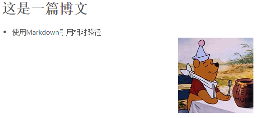

龚老师应该注意到了这里使用md语法的相对路径引用并不是相对md文件的路径，对md文件而言图片的相对路径应该是 *../这是一篇博文/pooh.gif*. 此处的相对路径是指生成了html页面后的相对路径。

### 文章的归档和标签
我们可以通过在md文件头部声明归档和标签的名字对文章进行分类:
```md
---
title: 这是一篇博文
date: 2020-02-02 16:20:56
tags: 日志
categories: 随便写写
---
```
这样Hexo就会在生成页面时自动将文章分类~

## 博客优化(进阶)
洋洋洒洒写了三千多字啦，如果龚老师读到这里，基本的博客搭建也应该完成得差不多了。下面我们可以研究一下一些进阶的功能～
### 加密文章
在通常情况下，我们写的大多数博客是可以分享出来的，一方面可以展示自己，另一方面也能帮助互联网上遇到同样问题的人。当然有时候我们也希望给博文加个锁，就像这篇文章一样～～
#### 安装加密插件
[hexo-blog-encrypt](https://github.com/MikeCoder/hexo-blog-encrypt)是一个基于**Crypto**的被广泛使用的加密插件，我们可以通过**npm**进行安装:
```bash
npm install --save hexo-blog-encrypt
```
#### 配置加密插件
在安装完插件后，我们需要在博客配置中(*_config.yml*)添加加密插件的相关配置:
```yml
# Security
encrypt: # hexo-blog-encrypt
  abstract: 有东西被加密了, 请输入密码查看.
  message: 您好, 这篇文章需要访问密码.
  tags:
  - {name: 只给漂亮的龚老师看, password: s..g}
  - {name: 只给帅气的李老师看, password: gyqqq}
  template: <div id="hexo-blog-encrypt" data-wpm="{{hbeWrongPassMessage}}" data-whm="{{hbeWrongHashMessage}}"><div class="hbe-input-container"><input type="password" id="hbePass" placeholder="{{hbeMessage}}" /><label>{{hbeMessage}}</label><div class="bottom-line"></div></div><script id="hbeData" type="hbeData" data-hmacdigest="{{hbeHmacDigest}}">{{hbeEncryptedData}}</script></div>
  wrong_pass_message: 抱歉, 这个密码看着不太对, 请再试试.
  wrong_hash_message: 抱歉, 这个文章不能被校验, 不过您还是能看看解密后的内容.
```
龚老师可以直接把上面的配置粘贴到博客配置文件的底部~ 在这里我们配置了两个加密tag("只给漂亮的龚老师看"和"只给帅气的李老师看")，只要给md文章中打上这个tag，访问的时候就会需要密码了。比如我们在md文件头部这样写:
```md
---
title: 这是一篇博文
date: 2020-02-02 16:20:56
tags: 只给漂亮的龚老师看
categories: 随便写写
---
```
在首页它是这样的:

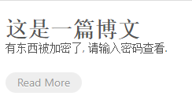

单击进入文章就会要求访问密码(`s..g`)了：

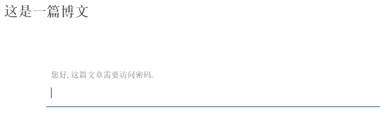

如果龚老师感兴趣的话可以查看网页源码，加密后的文章内容大概是这样的:
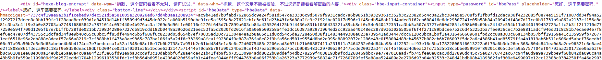

除非知道密码明文，不然要破解这段加密数据还是比较困难的～～

### 鼠标点击动画
上次淇淇说我的博客太花哨了唯一有意思的就是鼠标点击特效...

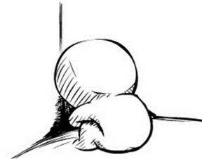

虽然被淇淇无情地嘲讽了，但是我还是要给淇淇写一下如何自定义鼠标点击特效，谁叫我是淇淇的男朋友呢，嘿嘿


其实实现原理并不复杂，我们可以通过在页面中插入js脚本绑定鼠标点击事件，并在事件触发的时候播放动画来实现点击特效~

下面给淇淇准备了几段监听点击事件并播放动画的代码和效果预览。

#### 爱心

```js
!function(e,t,a){function n(){c(".heart{width: 10px;height: 10px;position: fixed;background: #f00;transform: rotate(45deg);-webkit-transform: rotate(45deg);-moz-transform: rotate(45deg);}.heart:after,.heart:before{content: '';width: inherit;height: inherit;background: inherit;border-radius: 50%;-webkit-border-radius: 500%;-moz-border-radius: 50%;position: fixed;}.heart:after{top: -5px;}.heart:before{left: -5px;}"),o(),r()}function r(){for(var e=0;e<d.length;e++)d[e].alpha<=0?(t.body.removeChild(d[e].el),d.splice(e,1)):(d[e].y--,d[e].scale+=.004,d[e].alpha-=.013,d[e].el.style.cssText="left:"+d[e].x+"px;top:"+d[e].y+"px;opacity:"+d[e].alpha+";transform:scale("+d[e].scale+","+d[e].scale+") rotate(45deg);background:"+d[e].color+";z-index:99999");requestAnimationFrame(r)}function o(){var t="function"==typeof e.onclick&&e.onclick;e.onclick=function(e){t&&t(),i(e)}}function i(e){var a=t.createElement("div");a.className="heart",d.push({el:a,x:e.clientX-5,y:e.clientY-5,scale:1,alpha:1,color:s()}),t.body.appendChild(a)}function c(e){var a=t.createElement("style");a.type="text/css";try{a.appendChild(t.createTextNode(e))}catch(t){a.styleSheet.cssText=e}t.getElementsByTagName("head")[0].appendChild(a)}function s(){return"rgb("+~~(255*Math.random())+","+~~(255*Math.random())+","+~~(255*Math.random())+")"}var d=[];e.requestAnimationFrame=function(){return e.requestAnimationFrame||e.webkitRequestAnimationFrame||e.mozRequestAnimationFrame||e.oRequestAnimationFrame||e.msRequestAnimationFrame||function(e){setTimeout(e,1e3/60)}}(),n()}(window,document);
```

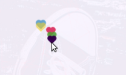

#### 文字和emoji

```js
var a_idx = 0;
jQuery(document).ready(function ($) {
    $("body").click(function (e) {
        var a = new Array
            ("😁", "钰淇妹妹", "💝", "智勤哥哥", "😀");
        var $i = $("<span/>").text(a[a_idx]);
        a_idx = (a_idx + 1) % a.length;
        var x = e.pageX,
            y = e.pageY;
        $i.css({
            "z-index": 5,
            "top": y - 20,
            "left": x,
            "position": "absolute",
            "font-weight": "bold",
            "color": "#FF0000"
        });
        $("body").append($i);
        $i.animate({
            "top": y - 180,
            "opacity": 0
        },
            3000,
            function () {
                $i.remove();
            });
    });
    setTimeout('delay()', 2000);
});

function delay() {
    $(".buryit").removeAttr("onclick");
}
```


#### 烟花
这个呢就是智勤哥哥博客上用的那个啦～

```js
"use strict"; function updateCoords(e) { pointerX = (e.clientX || e.touches[0].clientX) - canvasEl.getBoundingClientRect().left, pointerY = e.clientY || e.touches[0].clientY - canvasEl.getBoundingClientRect().top } function setParticuleDirection(e) { var t = anime.random(0, 360) * Math.PI / 180, a = anime.random(50, 180), n = [-1, 1][anime.random(0, 1)] * a; return { x: e.x + n * Math.cos(t), y: e.y + n * Math.sin(t) } } function createParticule(e, t) { var a = {}; return a.x = e, a.y = t, a.color = colors[anime.random(0, colors.length - 1)], a.radius = anime.random(16, 32), a.endPos = setParticuleDirection(a), a.draw = function () { ctx.beginPath(), ctx.arc(a.x, a.y, a.radius, 0, 2 * Math.PI, !0), ctx.fillStyle = a.color, ctx.fill() }, a } function createCircle(e, t) { var a = {}; return a.x = e, a.y = t, a.color = "#F00", a.radius = 0.1, a.alpha = 0.5, a.lineWidth = 6, a.draw = function () { ctx.globalAlpha = a.alpha, ctx.beginPath(), ctx.arc(a.x, a.y, a.radius, 0, 2 * Math.PI, !0), ctx.lineWidth = a.lineWidth, ctx.strokeStyle = a.color, ctx.stroke(), ctx.globalAlpha = 1 }, a } function renderParticule(e) { for (var t = 0; t < e.animatables.length; t++) { e.animatables[t].target.draw() } } function animateParticules(e, t) { for (var a = createCircle(e, t), n = [], i = 0; i < numberOfParticules; i++) { n.push(createParticule(e, t)) } anime.timeline().add({ targets: n, x: function (e) { return e.endPos.x }, y: function (e) { return e.endPos.y }, radius: 0.1, duration: anime.random(1200, 1800), easing: "easeOutExpo", update: renderParticule }).add({ targets: a, radius: anime.random(80, 160), lineWidth: 0, alpha: { value: 0, easing: "linear", duration: anime.random(600, 800) }, duration: anime.random(1200, 1800), easing: "easeOutExpo", update: renderParticule, offset: 0 }) } function debounce(e, t) { var a; return function () { var n = this, i = arguments; clearTimeout(a), a = setTimeout(function () { e.apply(n, i) }, t) } } var canvasEl = document.querySelector(".fireworks"); if (canvasEl) { var ctx = canvasEl.getContext("2d"), numberOfParticules = 30, pointerX = 0, pointerY = 0, tap = "mousedown", colors = ["#FF1461", "#18FF92", "#5A87FF", "#FBF38C"], setCanvasSize = debounce(function () { canvasEl.width = 2 * window.innerWidth, canvasEl.height = 2 * window.innerHeight, canvasEl.style.width = window.innerWidth + "px", canvasEl.style.height = window.innerHeight + "px", canvasEl.getContext("2d").scale(2, 2) }, 500), render = anime({ duration: 1 / 0, update: function () { ctx.clearRect(0, 0, canvasEl.width, canvasEl.height) } }); document.addEventListener(tap, function (e) { "sidebar" !== e.target.id && "toggle-sidebar" !== e.target.id && "A" !== e.target.nodeName && "IMG" !== e.target.nodeName && (render.play(), updateCoords(e), animateParticules(pointerX, pointerY)) }, !1), setCanvasSize(), window.addEventListener("resize", setCanvasSize, !1) } "use strict"; function updateCoords(e) { pointerX = (e.clientX || e.touches[0].clientX) - canvasEl.getBoundingClientRect().left, pointerY = e.clientY || e.touches[0].clientY - canvasEl.getBoundingClientRect().top } function setParticuleDirection(e) { var t = anime.random(0, 360) * Math.PI / 180, a = anime.random(50, 180), n = [-1, 1][anime.random(0, 1)] * a; return { x: e.x + n * Math.cos(t), y: e.y + n * Math.sin(t) } } function createParticule(e, t) { var a = {}; return a.x = e, a.y = t, a.color = colors[anime.random(0, colors.length - 1)], a.radius = anime.random(16, 32), a.endPos = setParticuleDirection(a), a.draw = function () { ctx.beginPath(), ctx.arc(a.x, a.y, a.radius, 0, 2 * Math.PI, !0), ctx.fillStyle = a.color, ctx.fill() }, a } function createCircle(e, t) { var a = {}; return a.x = e, a.y = t, a.color = "#F00", a.radius = 0.1, a.alpha = 0.5, a.lineWidth = 6, a.draw = function () { ctx.globalAlpha = a.alpha, ctx.beginPath(), ctx.arc(a.x, a.y, a.radius, 0, 2 * Math.PI, !0), ctx.lineWidth = a.lineWidth, ctx.strokeStyle = a.color, ctx.stroke(), ctx.globalAlpha = 1 }, a } function renderParticule(e) { for (var t = 0; t < e.animatables.length; t++) { e.animatables[t].target.draw() } } function animateParticules(e, t) { for (var a = createCircle(e, t), n = [], i = 0; i < numberOfParticules; i++) { n.push(createParticule(e, t)) } anime.timeline().add({ targets: n, x: function (e) { return e.endPos.x }, y: function (e) { return e.endPos.y }, radius: 0.1, duration: anime.random(1200, 1800), easing: "easeOutExpo", update: renderParticule }).add({ targets: a, radius: anime.random(80, 160), lineWidth: 0, alpha: { value: 0, easing: "linear", duration: anime.random(600, 800) }, duration: anime.random(1200, 1800), easing: "easeOutExpo", update: renderParticule, offset: 0 }) } function debounce(e, t) { var a; return function () { var n = this, i = arguments; clearTimeout(a), a = setTimeout(function () { e.apply(n, i) }, t) } } var canvasEl = document.querySelector(".fireworks"); if (canvasEl) { var ctx = canvasEl.getContext("2d"), numberOfParticules = 30, pointerX = 0, pointerY = 0, tap = "mousedown", colors = ["#FF1461", "#18FF92", "#5A87FF", "#FBF38C"], setCanvasSize = debounce(function () { canvasEl.width = 2 * window.innerWidth, canvasEl.height = 2 * window.innerHeight, canvasEl.style.width = window.innerWidth + "px", canvasEl.style.height = window.innerHeight + "px", canvasEl.getContext("2d").scale(2, 2) }, 500), render = anime({ duration: 1 / 0, update: function () { ctx.clearRect(0, 0, canvasEl.width, canvasEl.height) } }); document.addEventListener(tap, function (e) { "sidebar" !== e.target.id && "toggle-sidebar" !== e.target.id && "A" !== e.target.nodeName && "IMG" !== e.target.nodeName && (render.play(), updateCoords(e), animateParticules(pointerX, pointerY)) }, !1), setCanvasSize(), window.addEventListener("resize", setCanvasSize, !1) };
```

这里就不放图了，淇淇可以自己点点试试看呢～

#### 代码嵌入主题
淇淇准备好js代码后可以保存在<span style="color:red">*themes/next/source/js/src*</span>下:

```
themes/next/source/js/src/
├── fireworks.js
├── love.js
└── text.js
```

然后我们可以在主题配置文件<span style="color:red">*themes/next/_config.yml*</span>里加入配置选项方便我们控制脚本使能(淇淇可以放在文件最后面方便编辑):
```yml
# Assets
css: css
js: js
images: images

# Animations
fireworks: true
love: true
text: true
# 三个一起开会有点花哨，淇淇可以把不需要的注释掉
```

最后我们需要更改<span style="color:red">*themes/next/layout/_layout.swig*</span>将代码注入页面(在文件结尾body 和 html 标签之间):

```html
</body>
  
    <canvas class="fireworks" style="position: fixed;left: 0;top: 0;z-index: 1; pointer-events: none;" ></canvas> 
    <script type="text/javascript" src="//cdn.bootcss.com/animejs/2.2.0/anime.min.js"></script> 
    <script type="text/javascript" src="/js/src/fireworks.js"></script>
  

  
    <canvas class="love" style="position: fixed;left: 0;top: 0;z-index: 1; pointer-events: none;" ></canvas> 
    <script type="text/javascript" src="//cdn.bootcss.com/animejs/2.2.0/anime.min.js"></script> 
    <script type="text/javascript" src="/js/src/love.js"></script>
  

  
    <canvas class="text" style="position: fixed;left: 0;top: 0;z-index: 1; pointer-events: none;" ></canvas> 
    <script type="text/javascript" src="//cdn.bootcss.com/animejs/2.2.0/anime.min.js"></script> 
    <script type="text/javascript" src="/js/src/text.js"></script>
  
</html>
```

好了，先到这里吧～ 另外今天是女生节，我的钰淇妹妹女生节快乐哟～


### 休息一会儿...

让我陪我的钰淇小可爱听会儿歌吧～

<iframe frameborder="no" border="0" marginwidth="0" marginheight="0" width=330 height=86 src="//music.163.com/outchain/player?type=2&id=27907499&auto=1&height=66"></iframe>

<iframe frameborder="no" border="0" marginwidth="0" marginheight="0" width=330 height=86 src="//music.163.com/outchain/player?type=2&id=552060841&auto=0&height=66"></iframe>

<iframe frameborder="no" border="0" marginwidth="0" marginheight="0" width=330 height=86 src="//music.163.com/outchain/player?type=2&id=1323832567&auto=0&height=66"></iframe>

<iframe frameborder="no" border="0" marginwidth="0" marginheight="0" width=330 height=86 src="//music.163.com/outchain/player?type=2&id=1341884585&auto=0&height=66"></iframe>

<iframe frameborder="no" border="0" marginwidth="0" marginheight="0" width=330 height=86 src="//music.163.com/outchain/player?type=2&id=5112976&auto=1&height=66"></iframe>

我想带你骑单车 我想和你看棒球
像这样没担忧 唱着歌一直走

你靠着我的肩膀 你在我胸口睡着
像这样的生活 我爱你你爱我

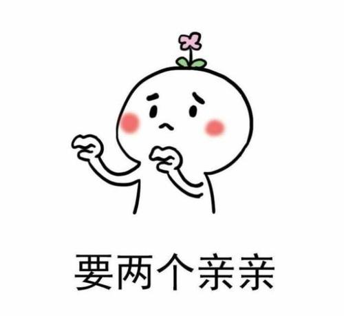

亲到啦～ 嘿嘿~ 我们继续吧～

### 本地搜索

随着时间的推移，淇淇写的文章越來越多～假如有一天，我的小可爱忘了R里的apply怎么用，但是我们记得～嗯～好像之前写过一篇文章说这件事， 那淇淇要怎么从一堆文章里找到自己要的那一篇呢？

当然是用站内搜索啦～它大概长这样:

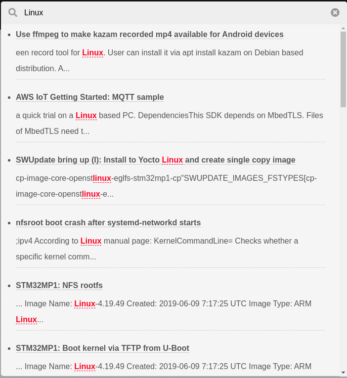

下面我们来看看如何给淇淇的小站集成站内搜索吧～

#### 安装搜索插件
在博客根目录下，运行

```bash
npm i --save hexo-generator-searchdb
```

#### 在Hexo配置里使能search
打开 `_config.yml`(博客根目录下的那个哟), 添加下面的代码

```yml
# Search
search:
  path: search.xml
  field: post
  format: html
  limit: 10000
```

#### 在Next主题配置里使能Local Search
打开`theme/next/_config.yml`， 找到`local_search`, 把`enable`改为`true`：

```yml
# Local Search
# Dependencies: https://github.com/theme-next/hexo-generator-searchdb
local_search:
  enable: true
  # If auto, trigger search by changing input.
  # If manual, trigger search by pressing enter key or search button.
  trigger: auto
  # Show top n results per article, show all results by setting to -1
  top_n_per_article: 1
  # Unescape html strings to the readable one.
  unescape: false
  # Preload the search data when the page loads.
  preload: false
```

保存之后`hexo s`试试～ 右上角有没有出现一个搜索的小图标呀～

### 添加文章字数统计
淇淇想不想让读者知道一篇文章有多少字,大概需要读多久呀~

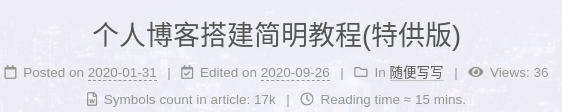

要是觉得需要加一个呢～就亲我一下😘(要是我暂时不在身边，就存起来，嘿嘿😋)继续读这一小节～

要是觉得没什么用～就亲我两下😎 然后[点我跳到下一小节吧～](#添加博客访问次数统计)

#### 安装字数统计插件
在博客根目录下哦～

```bash
npm i --save hexo-symbols-count-time
```

#### 在Hexo配置里添加字数统计配置
还是在博客根目录下的`_config.yml`哦：

```yml
symbols_count_time:
  symbols: true
  time: true
  total_symbols: true
  total_time: true
  exclude_codeblock: false
  awl: 4
  wpm: 275
  suffix: "mins."
```

这里我们假设每分钟读275个字，就能推算出需要多长时间才能读完啦

#### 在Next主题配置里使能字数统计
打开`theme/next/_config.yml`, 找到`symbols_count_time`:

```yml
# Post wordcount display settings
# Dependencies: https://github.com/theme-next/hexo-symbols-count-time
symbols_count_time:
  separated_meta: true
  item_text_post: true
  item_text_total: false
```

保存之后`hexo s`试试~ 除了单篇文章的字数统计，页面底部还会有整个博客的字数统计哦～

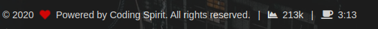

### 添加博客访问次数统计
要是每次打开博客，都发现访问人数长了一些，我的小可爱会不会觉得开心和自豪呢～

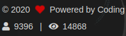

我们来一起给博客加一个访问次数统计吧～

#### 在Next主题配置里使能访客统计
下面的配置在`theme/next/_config.yml`里哦我的小可爱～

```yml
# Show Views / Visitors of the website / page with busuanzi.
# Get more information on http://ibruce.info/2015/04/04/busuanzi
busuanzi_count:
  enable: true
  total_visitors: true
  total_visitors_icon: fa fa-user
  total_views: true
  total_views_icon: fa fa-eye
  post_views: true
  post_views_icon: fa fa-eye
```

把`enable`改成`true`就好啦～ 
> 注意～`hexo s`时显示的是随机值，只有当部署到淇淇的[gyqgyq.com](http://gyqgyq.com)的时候，才会真正生效哦～因为这个统计是基于域名的呢

好啦～ 今天先到这里～ 今天(2020/09/26)我们在一起8个月啦～而且我马上就要见到我的小可爱啦🥳
(说起来还是有一点点紧张呢)

7月份以来，我的淇淇有时候心情会不太好，不过不要担心，我一直都在呢


未完待续...
