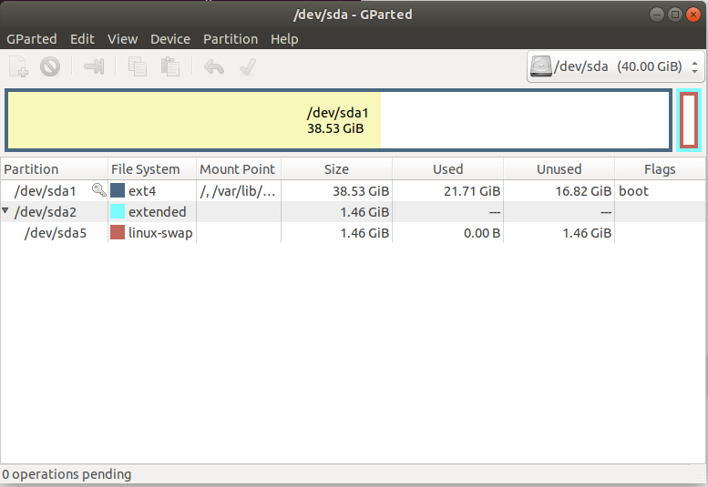

  前段时间跑机器学习，使用docker下了几个tensorflow的镜像，突然发现磁盘不够用了。相关的命令行不太熟，就想找找是不是有类似于分区精灵的带GUI的分区工具，还真找到一个Gparted。
<!--more-->
  首先安装Gparted，然后运行：
```bash
# apt-get install gparted
# gparted
```
  如果是Ubuntu 17.10或以上版本，可能会报错：
```bash
# gparted
Created symlink /run/systemd/system/-.mount → /dev/null.
Created symlink /run/systemd/system/run-user-1000.mount → /dev/null.
Created symlink /run/systemd/system/run-user-121.mount → /dev/null.
Created symlink /run/systemd/system/run-vmblock\x2dfuse.mount → /dev/null.
Created symlink /run/systemd/system/tmp.mount → /dev/null.
Created symlink /run/systemd/system/var-lib-docker-overlay2.mount → /dev/null.
Created symlink /run/systemd/system/var-lib-docker-plugins.mount → /dev/null.
No protocol specified

(gpartedbin:3041): Gtk-WARNING **: cannot open display: :0
Removed /run/systemd/system/-.mount.
Removed /run/systemd/system/run-user-1000.mount.
Removed /run/systemd/system/run-user-121.mount.
Removed /run/systemd/system/run-vmblock\x2dfuse.mount.
Removed /run/systemd/system/tmp.mount.
Removed /run/systemd/system/var-lib-docker-overlay2.mount.
Removed /run/systemd/system/var-lib-docker-plugins.mount.
```
  google了一下，原因是应用没有完全支持Wayland。但是有workaround:
```bash
$ xhost +SI:localuser:root
```
  之后就可以正常运行了。首先将当前分区扩容。之后添加一个扩展分区，再在扩展分区下添加linux-swap。最后别忘了应用修改。
  
