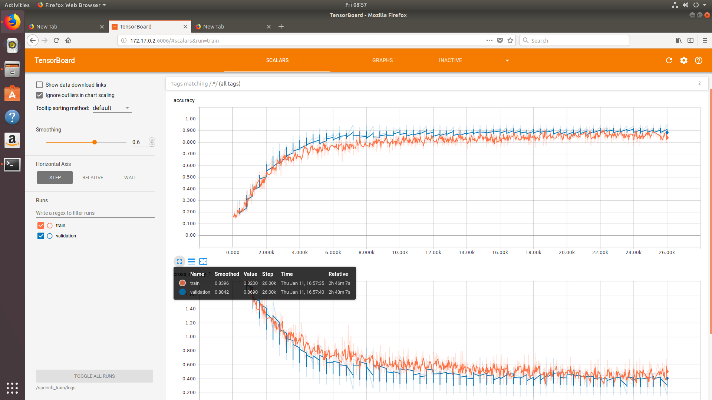

  这次来训练一个基于CNN的语音识别模型。训练完成后，我们将尝试将此模型用于Hotword detection。
<!--more-->
  人类是怎样听懂一句话的呢？以汉语为例，当听到“wo shi”的录音时，我们会想，有哪两个字是读作“wo shi”的，有人想到的是“我是”，也有人觉得是“我市”。 
我们可以通过"wo shi"的频率的特征，匹配到一些结果，我们这次要训练的模型，也是基于频率特征的CNN模型。单纯的基于频率特征的识别有很大的局限性，比如前面提到的例子，光是听到“wo shi”可能会导致产生歧义，但是如果能有上下文，我们就可以大大提高“识别”的成功率。因此，类似Google Assistant那样的识别，不光是考虑到字词的发音，还联系了语义，就算有一两个字发音不清，我们还是能得到正确的信息。
但是基于频率特征的模型用作Hotword detection还是比较合适的，因为Horword通常是一两个特定的词，不需要联系语境进行语义分析。
## 准备训练数据集
  开源的语言数据集比较少，这里我们使用TensorFlow和AIY团队推出的一个数据集，包含30个基本的英文单词的大量录音：
[下载地址](https://download.tensorflow.org/data/speech_commands_v0.01.tar.gz)
这个数据集只有1G多，非常小的语音数据集，不过用来实验是完全够的。
## 运行docker并挂载工作目录
新建一个speech_train文件夹，并在其中创建子文件夹dataset,logs,train,它们将用于存放数据集，log和训练文件。解压数据集到dataset，然后运行docker：
```bash
docker run -it -v $(pwd)/speech_train:/speech_train \
  gcr.io/tensorflow/tensorflow:latest-devel
```
## 使用默认的conv模型开始训练
```bash
cd /tensorflow/
python tensorflow/examples/speech_commands/train.py \
--data_dir=/speech_train/dataset/ \
--summaries_dir=/speech_train/logs/ \
--train_dir=/speech_train/train/ \
--wanted_words=one,two,three,four,five,marvin
```
在这里我们指定希望识别的label: one,two,three,four,five,marvin。数据集的其他部分将被归为_unknown_
## 使用TensorBoard使训练可视化
我们可以通过分析生成的log使训练过程可视化：
```bash
tensorboard --logdir /speech_train/logs
```
运行指令后，可以通过浏览器访问本地的6006端口进入TensorBoard。下图是使用conv模型完成18000 steps 训练的过程图：

训练花了差不多15个小时。
## 生成pb文件
训练完成后，我们需要将其转化为pb文件：
```bash
python tensorflow/examples/speech_commands/freeze.py \
--start_checkpoint=/speech_train/train/conv.ckpt-18000 \
--output_file=/speech_train/conv.pb \
--wanted_words=one,two,three,four,five,marvin
```
完成后，我们将得到一个名为conv.pb的文件，配合包含可识别label的txt文件就可以直接使用了。
## 测试
使用测试脚本进行测试：
```bash
python tensorflow/examples/speech_commands/label_wav.py \
--graph=/speech_train/conv.pb \
--labels=/speech_train/conv_labels.txt \
--wav=/speech_train/dataset/marvin/0b40aa8e_nohash_0.wav
```
训练的模型应能正确识别出marvin。
## 使用准确度较低但是预测更快的low_latency_conv模型
  我们可以使用另外一种准确度较低但是预测更快的low_latency_conv模型进行训练：
```bash
python tensorflow/examples/speech_commands/train.py \
--data_dir=/speech_train/dataset/ \
--summaries_dir=/speech_train/logs/ \
--train_dir=/speech_train/train/ \
--model_architecture=low_latency_conv \
--how_many_training_steps=20000,6000 \
--learning_rate=0.01,0.001 \
--wanted_words=one,two,three,four,marvin,wow
```
当使用该模型时，可以适当增加training steps和learning rate。在这种情况下，训练的时间大大缩短了：

只花了不到3小时.
## 其他
也可以使用gpu版本的tensorflow进行训练，速度可以提升不少哦。
