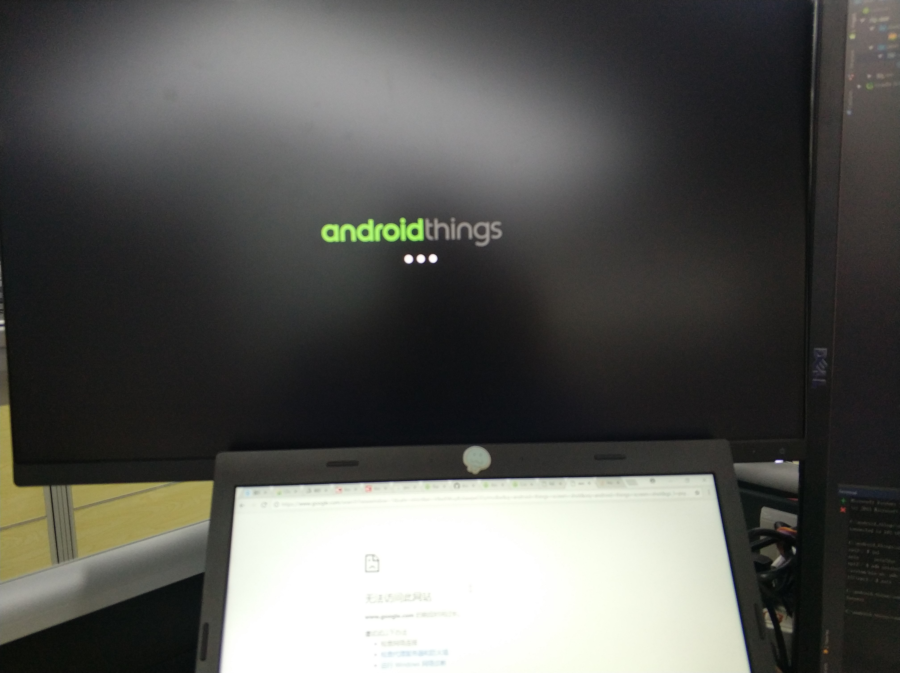
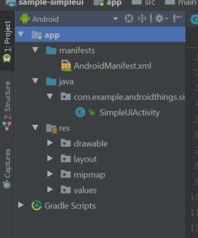
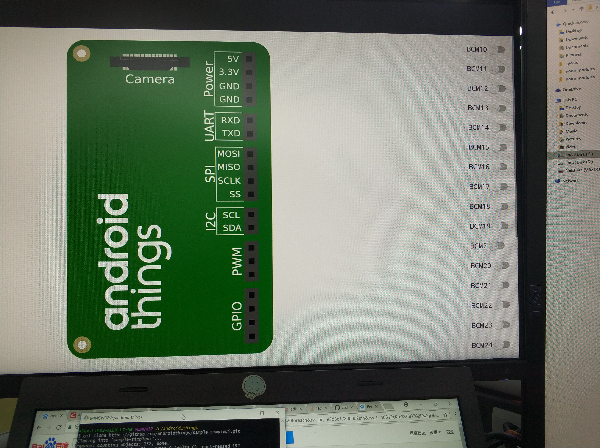

  Google推出Android Things都快一年了，现在还在preview阶段，而且现在支持的平台也很少，但是这些都无法阻挡我们试水的热情...
<!--more-->

## 准备工作
  1.Raspberry Pi 3
  2.HDMI cable and monitor(据说有类似于VNC的工具，但是显示分辨率有问题)
  3.Ethernet cable(第一次连接需要)
  4.Micro SD card

## 生成IMAGE
  首先在[Android Things Console](https://partner.android.com/things/console/)上生成Image。新建一个product,输入Product name,选择SOM Type。之后可以添加Bundle自定义开机动画等设置，也可以直接使用Empty bundle。之后选择一个Android Things versions, Create build configuration后，可以进行在线的build和Image生成(之前据说最开始本地build用服务器级的至强cpu都要build 5个小时)，下载生成的zip file。

## 烧录Image
  解压下载的zip file，解压得到使用烧录工具(比如Etcher)将iot_rpi3.img烧录至SD card。

## 启动并连接设备
  接好HDMI和Ethernet，插入SD card就可以开机了！

  
  
  接下来我们测试一下Ethernet的连接性。如果连接正常，屏幕上是会显示当前的ip地址的。使用adb尝试连接一下：
```bash
adb connect 192.168.1.66
```
当你看见如下内容，表明adb连接成功：
```bash
connected to 192.168.1.66:5555
```
在连接上adb后，我们可以设置通过wifi连接以摆脱网线的束缚
```bash
adb shell
am startservice \
    -n com.google.wifisetup/.WifiSetupService \
    -a WifiSetupService.Connect \
    -e ssid network_ssid \
    -e passphrase network_pass \
```
其中network_ssid尝试连接的wifi ssid，network_pass为密码（开放网络中该参数可以不填）。然后我们需要验证一下无线连接
```bash
logcat -d | grep Wifi
```
当看见WifiWatcher: Network state changed to CONNECTED时，表明连接成功。这时可以尝试断开adb,拔掉网线,使用adb连接无线ip,连接成功后可以ping一下百度：
```bash
ping baidu.com
```
如果想清除所有保存的wifi连接设置：
```bash
am startservice \
    -n com.google.wifisetup/.WifiSetupService \
    -a WifiSetupService.Reset
```

## UI DEMO
  这里以官方的UI DEMO(om.example.androidthings.simpleui)为例，跑个带UI的app试一下。
### 程序结构
  Things工程的结构和普通Android app结构很相似，Things的更加简单。还是熟悉的AndroidManifest.xml + java + res。

  

  在Manifest中声明主题、入口Activity、权限等，在layout中，Android基本的控件都有。。。总而言之，和普通Android开发相似度极高，以致于我都不想写下去了。。。
### 代码
  贴段几段代码，分析下值得注意的地方。首先import了几个在Android开发中没见过的包：
```java
import com.google.android.things.pio.Gpio;
import com.google.android.things.pio.PeripheralManagerService;
```
非常明显的things包，提供了gpio类，以及一个很重要的PeripheralManagerService. 我们通过PeripheralManager来操作外设。树莓派3的gpio name可以通过getGpioList获得，要对某个gpio进行控制，需要先openGpio(init)，然后可以通过setDirection设置io方向及初始电平，setEdgeTriggerType设置边缘触发模式(中断)，setActiveType设置高电平为true还是低电平为true，setValue来更改电平。当setActiveType(Gpio.ACTIVE_LOW)时，setValue(true)会输出低电平，反之亦然。

```java
public class SimpleUiActivity extends Activity {

    private static final String TAG = SimpleUiActivity.class.getSimpleName();

    private Map<String, Gpio> mGpioMap = new LinkedHashMap<>();

    @Override
    protected void onCreate(Bundle savedInstanceState) {
        super.onCreate(savedInstanceState);
        setContentView(R.layout.activity_main);

        LinearLayout gpioPinsView = (LinearLayout) findViewById(R.id.gpio_pins);
        LayoutInflater inflater = getLayoutInflater();
        PeripheralManagerService pioService = new PeripheralManagerService();

        for (String name : pioService.getGpioList()) {
            View child = inflater.inflate(R.layout.list_item_gpio, gpioPinsView, false);
            Switch button = (Switch) child.findViewById(R.id.gpio_switch);
            button.setText(name);
            gpioPinsView.addView(button);
            Log.d(TAG, "Added button for GPIO: " + name);

            try {
                final Gpio ledPin = pioService.openGpio(name);
                ledPin.setEdgeTriggerType(Gpio.EDGE_NONE);
                ledPin.setActiveType(Gpio.ACTIVE_HIGH);
                ledPin.setDirection(Gpio.DIRECTION_OUT_INITIALLY_LOW);

                button.setOnCheckedChangeListener(new CompoundButton.OnCheckedChangeListener() {
                    @Override
                    public void onCheckedChanged(CompoundButton buttonView, boolean isChecked) {
                        try {
                            ledPin.setValue(isChecked);
                        } catch (IOException e) {
                            Log.e(TAG, "error toggling gpio:", e);
                            buttonView.setOnCheckedChangeListener(null);
                            // reset button to previous state.
                            buttonView.setChecked(!isChecked);
                            buttonView.setOnCheckedChangeListener(this);
                        }
                    }
                });

                mGpioMap.put(name, ledPin);
            } catch (IOException e) {
                Log.e(TAG, "Error initializing GPIO: " + name, e);
                // disable button
                button.setEnabled(false);
            }
        }
    }

    @Override
    protected void onDestroy() {
        super.onDestroy();

        for (Map.Entry<String, Gpio> entry : mGpioMap.entrySet()) {
            try {
                entry.getValue().close();
            } catch (IOException e) {
                Log.e(TAG, "Error closing GPIO " + entry.getKey(), e);
            }
        }
        mGpioMap.clear();
    }
}
```
### 运行结果
  